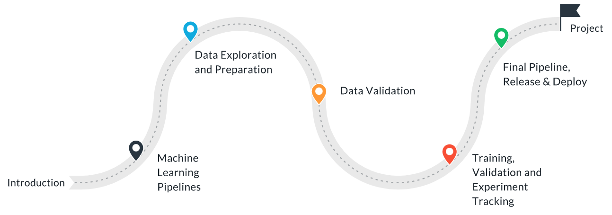
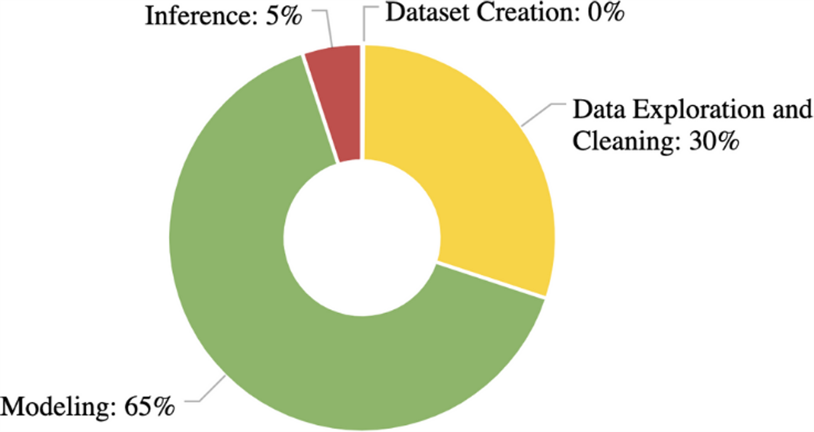
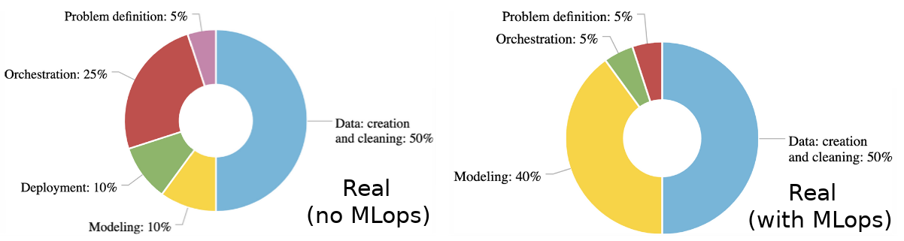
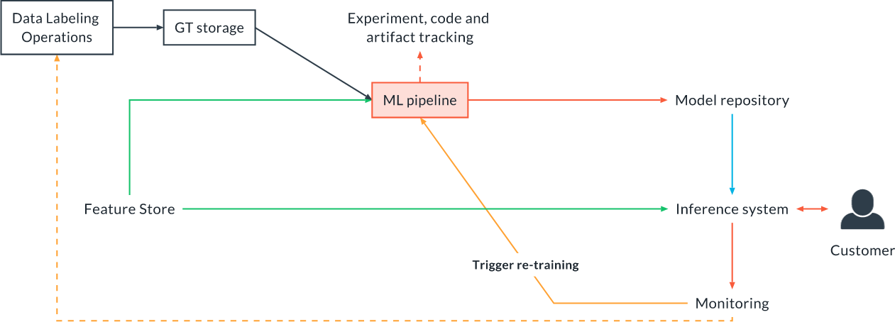
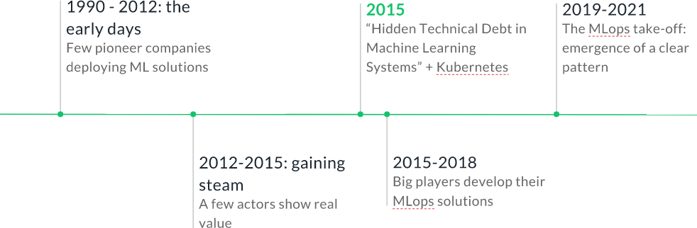
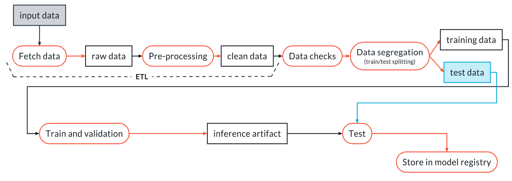

# Introduction to Reproducible Model Workflows

### What You Will Learn

In this class you will learn how to:

1. Create a clean, organized, reproducible, end-to-end machine learning pipeline from scratch
2. Transform, validate and verify your data (avoid “garbage in, garbage out”)
3. Run experiments, track data, code, and results
4. Select the best performing model and promote it to production
5. Create an artifact ready for deployment, and release your final pipeline

While the project and the examples will focus on a classical Machine Learning problem (with tabular data and scikit-learn), all the concepts and techniques apply to other settings as well (like computer vision and NLP) and other libraries (PyTorch, TensorFlow, etc.). To illustrate this, we will go through some computer vision examples in this course.

### Course Outline

The first two lessons contain some fundamental notions about MLops and reproducible workflows:

1. Introduction: we will cover the content of the class, prerequisites, and set up tools and environments so you can work on the exercises and learn.
2. Machine Learning pipelines: we will review the different levels of MLops and when to use them, we will define machine learning pipelines, see some examples and learn how to write them.

Then, we will dive into each section of a typical Machine Learning training pipeline:

3. Data Exploration and Preparation
4. Data Validation
5. Training, Validation, and Experiment Tracking

We will finally see how to put everything together:

6. Final Pipeline, Release, and Deploy

Lesson Outline

In this introductory lesson, you will find:

- The prerequisites of the course
- A brief intro to Machine Learning Operations (MLops)
- Why reproducible model workflows and pipelines are important
- Who the business stakeholders for MLops are
- When to use reproducible workflows
- The history of MLops
- The tools and environment used throughout the course
- A brief intro to the project you will build at the end of the course

**Resources**

**Python**

> [Review python concepts](https://developers.google.com/edu/python)
> 
> [Context managers](https://book.pythontips.com/en/latest/context_managers.html#context-managers)
> 
> [Decorators](https://book.pythontips.com/en/latest/decorators.html?highlight=decorators)

**Machine Learning**

> [ML and scikit-learn basics](https://scikit-learn.org/stable/tutorial/basic/tutorial.html)
> 
> [Scikit-learn guide](https://scikit-learn.org/stable/user_guide.html)

**Terminal**

> [Concept and basic commands](https://ubuntu.com/tutorials/command-line-for-beginners#1-overview) (if you are not on Ubuntu, ignore the ubuntu-specific parts and focus on the commands and the concepts)

## Academic/competition settings vs real world applications

In an academic setting, or in a Kaggle competition, we are given a problem as well as a dataset. We explore the data a bit, then we dive into the modeling and we iterate over techniques, hyperparameters, and maybe some more data exploration, trying to find a good strategy to optimize a metric of interest. The goal is to improve the metric as much as possible, with little regard for model complexity. This means that our time allocation might look something like this:

Applying Machine Learning in a real-world scenario looks very different. Here, the focus is on production, because we want to build something that can be used reliably in practice. This has some important consequences. For starters, we have to decide which problem to solve, and then figure out if we actually need ML or not. If we do, we go and collect the data we need to solve the task. We then need to clean and process the data, develop a model, and then deploy it in a production system where it can be used. Our model therefore needs to be able to run in production. This is how the process might look like:

MLops is the discipline that study and describes the best practices to develop a model for production. Let's see in more details what MLops is below.

**So What is MLops?**

MLops is a set of best practices and methods for an **efficient** end-to-end development and operation of **performant**, **scalable**, **reliable**, **automated** and **reproducible** ML solutions in a real production setting. This is how the time allocation of a typical real-world project might look like, with and without MLops:

### Why Reproducible Workflows Are Important

While we will go into the details of these steps in future videos, it is clear that the workflow can be pretty complex. MLops workflows encompass several stages and many tools, like the Feature Store, the Model Repository, the Experiment and Artifact tracking solution, and so on. Do not worry, we are going to go over all these tools later in the class. The design, automation, versioning and documentation of processes like this constitute the bulk of MLops.

According to Garner, 50 percent of the ML projects fail to reach production. So can MLops ensure the success of an ML project? While it certainly is a fundamental piece of the solution in a production setting, it is not the only one. You also need:

 1. A problem worth solving. A problem with a sustained interest. 
 2. Reasonable goals and timelines (do not over-promise and under-deliver). The right culture. 
 3. Enough data for the task. Many fail to estimate this. 
 4. A strategy for maintaining the model in production. You cannot just deliver the model once and expect it to perform well forever. 
 5. A focus on production: the final use case must be driving all your decisions from the beginning, otherwise you risk developing a solution that cannot be used in practice
 6. The right team and skills: ML is a cross-functional task. You need DE, DS, MLE, SE and PMs for it to work

Machine Learning projects are a team effort. So who are the people involved in them? A typical team will contain the following roles:

1. Data Scientists and ML Engineers: the main people responsible for the development and the performance measurement
2. Data Engineers: responsible for the data ingestion pipelines and the quality of the data, as well as provisioning the right data at inference time (in production)
3. Software Engineers: they are responsible for the production environment. They are necessary partners to think about deployment, and what are the constraints in terms of processing power, latency, throughput, and so on.
4. DevOps Engineer: they are responsible for handling the infrastructure: training servers, the different MLops tools, and any other infrastructure needed to train and deploy a model.
5. Product Managers: they define the right problem to solve, exploiting their knowledge about customers' needs. They keep the project on time and on budget. For them, MLops is a tool allowing for faster and more reliable deployment.
6. Customers: MLops and reproducible workflows are hidden from them, but they are going to notice improved reliability and a faster pace of improvements and enhancements in the product.

### When To Use Reproducible Workflows

Whatever you are developing, from a personal project to a real-world ML product designed for production, some level of MLops will always help you be more efficient and effective. However, for personal projects and MVP, you want to strike a balance between time invested in developing the MLops workflow and the return you get from it. Beyond these two cases, in every other case where the target is production, you should use a good amount of MLops practices and build reproducible workflows. This will allow you to reuse code and effort, to collaborate effectively within the team and with other teams, and to keep things under control even in complex projects.

### History of Reproducible Workflows

Arbatrary division of MLops in 4 epochs

I personally consider the publication of the paper "Hidden Technical Debt in Machine Learning Systems" and the advent of Kubernetes, which both happened in 2015, to be the start of MLops as a discipline. The paper defined most of the problems that MLops aim to solve around ML systems, while Kubernetes opened a universe of possibilities for scalable, real-world ML systems.

### Project: Build an ML Pipeline for Rental Prices in NYC

In the final project, you will put all you have learned in the class to the test. You will write a Machine Learning Pipeline to solve the following problem: a property management company is renting rooms and properties in New York for short periods on various rental platforms. They need to estimate the typical price for a given property based on the price of similar properties. The company receives new data in bulk every week, so the model needs to be retrained with the same cadence, necessitating a reusable pipeline. You will write an end-to-end pipeline similar to the following:

You will then run it on an initial data sample and train your model, and re-train on new data by re-running on a new data sample simulating a new data delivery.