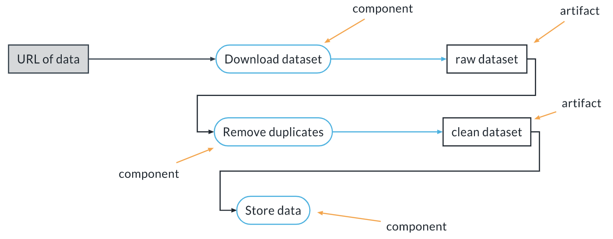
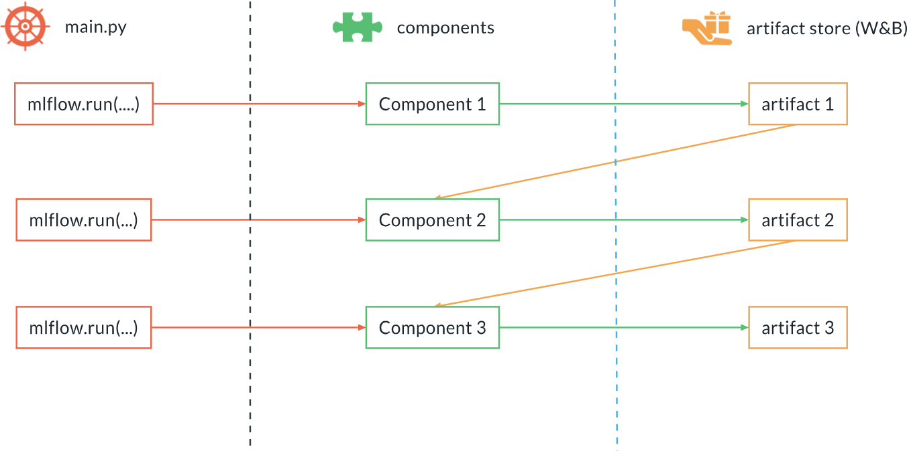
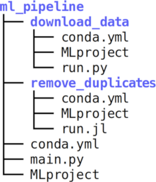

# Machine Learning Pipelines

**Introduction**

In this lesson, we concern ouseleves with machine Learning Pipleins, including:
- What is a ML pipeline and why it is useful
- The thress levels of MLops
- A refression on using `argparse`
- Versioning data and artifacts with Weights and Biases
- ML pipeline Components in MLflow
- Linking togethere the components into a pipeline
- Conda vs Docker

A Machin Learning pipeline is made of:

- Components (or steps): independent, reusabel and modular pieces of software that receive one or more imputes and produce one or more output. The cand be scripts, notebooks or other executables.
- Artifacts: the product of components. They can become the inputs of one or more subesquent components, thereby linking together the steps of the pipeline. Artifacts must be tracked and versioned. 

This is a example of a simple ML pipeline (in this case, an ETL pipeline):



### Why Use ML Pipelines: The 3 Levels of MLops

We will see now the 3 levels of MLops and their use. The basics of the classification is taken from this document by Google Cloud. We will be adding some context and several details to make clearer its application in practice.

**Level 0**

This is the level where there is no MLops process. It is ok for personal projects, when learning something new, or for demos and MVPs. In all these cases the overhead of a proper MLops process might be sacrificed because of deadlines and time budget. The main features of this stage are:

- The code is monolithic - one or few scripts or Jupyter notebooks, with limited reusability
- The target of the development is a model, and not a ML pipeline (we will see later what this means)
- There is limited concern for production during development, hence the model needs to be reimplemented for production, maybe by a different team
- No awareness of the need for model monitoring and retraining

### Levels 1 & 2

**Level 1**

As soon as you are past the proof of concept stage and you are targeting production, you should consider a more mature process, starting with level 1. These are its features:

- The target of the development is a ML pipeline that can produce a model at any time. This makes it easy to re-train on new data, for example.
- The pipeline is made with reusable components
- You are tracking code, artifacts and experiments for reproducibility and transparency
- The output of the ML pipeline is an inference artifact that contains the pre-processing steps, so these do not need to be reimplemented for production (more on this later)
- The model is monitored in production

With respect to level 0, level 1 produces the following advantages:

- Process standardization
- Rapid prototyping
- Faster go-to-market with new products
- Avoid model drift

**Level 2**

This is the process for mature, large scale ML companies. Here we shift our focus from developing ML pipelines to improving the pipeline components. This assumes we already have several ML pipelines in production. The automation at this level is much higher, and we have processes for:

- Continuous integration: every time a component is changed integration tests are run to ensure that the component works as expected
- Continuous deployment: each component passing the tests is automatically deployed and starts running as part of the ML pipelines in production
- Continuous Training: when a component changes or when new data arrives the ML pipelines are triggered and new models are trained, tested and deployed automatically

With respect to level 1, level 2 features:

- Rapid iteration on prod pipelines and models
- Easy A/B testing of changes
- Easy collaboration and improvements across large teams
- Continuous improvements in production. The customer sees a continuously-improving product


## Versioning Data and Artifacts 
- Using Weights and Biases [wandb.ai](https://wandb.ai/site)

In Weights & Biases (and in many other tools) we have the following concepts:

- **Run**: the basic unit of computation, it usually corresponds to the execution of one script or of one Jupyter notebook, although multiple runs per script/notebook are possible. In W&B each run is assigned automatically a unique name (like `sunny-spring-21`), unless you force a specific name using the `name` keyword of `wandb.init` (we will only use automatic names in this class). You can attach to a run:
- - parameters
- - metrics
- - artifacts
- - images / plots
- **Experiment**: a group of one or more runs. For example, we can collect the execution of one entire pipeline into one experiment: each component will have its own run, but all the runs are grouped into one experiment. Experiments can be compared to each other in the W&B interface just like runs. All the metrics collected by all runs become metrics of the experiment. In W&B the experiment name is indicated by the optional `group` keyword of `wandb.init`. If you do not specify a group (i.e., an experiment name) the run will be ungrouped, i.e., will not belong to any experiment (but still belong to its project).
- **Project**: a heterogeneous collection of all runs, experiments, and artifacts related to a specific goal. A project collects all the work related to the same objective. W&B allows one to look at one project at a time.
- **Artifact**: any file or directory produced by our code during a run. Every artifact that is logged to a run is automatically versioned by W&B. For example, if two runs produce an artifact with the same name (say a file named `model.h5`) but the content of the file is different, W&B will generate two versions (for example v1 and v2). On the contrary, if two runs produce the exact same file (same name and same content), W&B will recognize this and will NOT generate a new version.

Optionally you can specify a `job_type` for each run. This is useful when visualizing your pipeline. Normally the job_type express the function of your script, for example `data_cleaning` or `preprocessing` or `model_training`.

When using W&B you can start a run in this way:

```
import wandb

wandb.init(
    project="my_project",
    group="experiment_1",
    job_type="data_cleaning"
)

```
Supporting Materials

> [Upload_And_Version_Artifacts.ipynb](https://video.udacity-data.com/topher/2021/June/60c30f1a_upload-and-version-artifacts/upload-and-version-artifacts.ipynb)


## Write a ML Pipeline Component with MLflow

An MLflow project is a package of data science code that is reusable and reproducible. Projects can be chained together into workflows. We are going to use MLflow projects to define our components and chain them together in ML pipelines.

An MLflow project is made of 3 parts:

1. Code: the code that we want to use
2. Environment definition: specifies the dependencies of our code
3. Project definition: it specifies what is contained in the project and how a user should interact with the project

**The code**

The code here can be anything we want. It can depend on other packages, which will be specified in the environment definition. It is important to note that the code can be in any language, not just Python. So for example we can write components in Julia, R, Bash, Go or anything else. When putting together pipelines, we can even mix and match components written in different languages.

**Environment definition (`conda.yml`)**

MLflow allows to define the dependencies of our code (i.e., the runtime environment) using either conda or Docker. In the class we will focus mainly on conda, although we will see at a high level how to use docker as well.

Conda is a language-agnostic package manager that supports Linux, Mac OSX and Windows. Its scope is much larger than pip, which is limited to Python. Indeed, Conda is much more similar to other package managers like apt, yum or brew, however it is multi-platform.

For more information see [this blog post](https://towardsdatascience.com/conda-essential-concepts-and-tricks-e478ed53b5b).

A conda environment for an MLflow project is defined by a YAML file (if you are not familiar with YAML, see the quick introduction at the bottom of the page). This file is typically called `conda.yml` and has the following structure:

```
name: download_data
channels:
  - conda-forge
  - defaults
dependencies:
  - requests=2.24.0
  - pip=20.3.3
  - mlflow=1.14.1
  - hydra-core=1.0.6
  - pip:
      - wandb==0.10.21
```

The `name` section specifies the environment name (this can be anything). The `channels` section lists the channels where the `dependencies` will be looked up (in order). Then the dependencies section lists the dependencies. You should always also indicate the full version you need, in order to ensure reproducibility. If you need packages that are not available in the conda channels, but are available in pip, you can add a `pip` section and list there the `pip` dependencies.

NOTE: for conda packages the version is indicated by one equal sign, like `=2.24.0`, while for `pip` packages you have to use two equal signs, like `==0.10.21`.

**Project definition (`MLproject`)**

The project definition is contained in a YAML file called `MLProject` (without `.yml` nor `.yaml` extension). This file has the following structure:

```
name: download_data
conda_env: conda.yml

entry_points:
  main:
    parameters:
      file_url:
        description: URL of the file to download
        type: uri
      artifact_name:
        description: Name for the W&B artifact that will be created
        type: str

    command: >-
      python download_data.py --file_url {file_url} \
                              --artifact_name {artifact_name}
  other_script:
    parameters:
        parameter_one:
          description: First parameter
          type: str
    command: julia other_script.jl {parameter_one}
```

The `name` section specifies the name for the environment in which this code will be executed. It is not really important. Then the `conda_env: conda.yml` section specifies that this is a conda-based project (as opposed to a Docker-based project). Finally, the most important section, the `entry_points` section. This lists all the available scripts and commands that the user can run. This section MUST always have a `main` key which specifies the default script to run, and can optionally have other entry points (in our example, the `other_script` entry point). For each entry point we have the `parameters` section and the `command` section, specifying respectively the parameters for the command and how to run the command.

**Running the Project**

Running a MLflow project is accomplished with the mlflow run command, followed by a location specifier. A location can be a local path:

```
mlflow run /path/to/the/local/folder
```

or a remote Git repository:

```
mlflow run git@github.com/my_username/my_repo.git
```

Paremeters are specified using `-P [parameter_name]=[paremeter value]`. You will need to specify one `-P` option for each parameter. For example, to specify a parameter `file_url` and a parameter `artifact_name` you can do:

```
mlflow run ./by_project -P file_rul=https://myurl.com -P artifact_name=my-artifact
```

When running from a remote Git repository, you can specify a release or branch by using the -v option. For example, to run version `1.2.3` you can do:

```
mlflow run git@github.com/myusername/my_repo.git -b 1.2.3
```

## Linking Together the Components
The structure of an ML pipeline int MLflow is the following:



We have a main script. which we will called `main.py`, that contains several calls to `mlflow.run`, one for each component to call. `mlflow.run` is the equivalent of the command `mlflow run` and it allows to run a component from a script. Each component is called from the main script and it produces one ore more output artifacts that are stored in the artifact store (W&B for us). The output of one component becomes the input to the next. So the artifacts are the glue linking together the components into the pipeline. Of course, while in this example we have one output from each component, a component can create as many output artifacts as needed. A component can also receive in input as many artifacts as needed.

This is how you run an MLflow component using `mlflow.run`

```
import mlflow

mlflow.run(
  # URI can be a local path or the URL to a git repository
  # here we are going to use a local path
  uri="my_project",
  # Entry point to call
  entry_point="main",
  # Parameters for that entry point
  parameters={
    "file_url": "https://...",
    "artifact_name": "my_data.csv"
  }
)
```

This is equivalent to the following command from the command line:

```
mlflow run my_project -e main -P file_url="https://..." -P artifact_name="my_data.csv"
```

Then, a complete ML pipeline written with the MLflow looks like this: 



We have a project containing the main script (`main.py`) as well as the `conda.yml` and `MLproject` file for the main script. Then we have one subdirectory for each component. Each subdirectory is a MLflow project, i.e., it contains the code as well as the relative conda.yml and MLproject files.

For a pipeline like this, the `main.py` file could look like:

```
import mlflow

mlflow.run(
  uri="download_data",
  entry_point="main",
  parameters={
    "file_url": "https://...",
    "output_artifact": "raw_data.csv"
  }
)

mlflow.run(
  uri="remove_duplicates",
  entry_point="main",
  parameters={
    "input_artifact": "raw_data.csv:latest",
    "output_artifact": "clean_data.csv"
  }
)
```

A few things to note:

1. The output artifact of the first step (`raw_data.csv`) becomes the input of the next step
2. Let's look at the second component, `remove_duplicates`. Since we are using W&B, we have to specify the version when indicating an input artifact, so we say `raw_data.csv:latest` and not just `raw_data.csv`. The special tag latest indicates that we want to use the latest available version, which is the one that was just produced by the previous step. If we want to use a specific version, we can say for example `raw_data.csv:v2` to use version 2.

### Pipeline configuration

Hydra is a package to configure complex applications. It allows to define configuration files containing default values for all the parameters, so that it is easier to keep track of them and to know what they are for. Parameters can be overridden from the command line, and multiple runs can be generated with one single command (for example, for hyperparameter optimization).

A configuration file is a YAML file that can be organized as we please. It typically makes sense to have one section for each step in the pipeline, plus one for the main script. For example:

```
main:
  project_name: my_project
  experiment_name: dev
data:
  train_data: "exercise_6/data_train.csv:latest"
random_forest_pipeline:
  random_forest:
    n_estimators: 100
    criterion: gini
    max_depth: null
```

In order to use Hydra in a script we just need to add a decorator to the function that uses it. For example, our main script will now look like:

```
import mlflow
import hydra

@hydra.main(config_name="config")
def go(config):
  # Now here config is a dictionary with our configuration
  # For example, to access the parameter train_data in the data
  # section we can just do
  train_data = config["data"]["train_data"]

  ...


if __name__=="__main__":
  go()
```

Two things to note:

1. since we are using hydra for our main script, we do not use `argparse` for it
2. the `go` function is invoked without any argument. The `config` argument is added by the decorator, which reads the configuration file specified by `config_name`. Using `config_name="config"` means that Hydra is going to look for the configuration in `config.yaml` (note that is `yaml` and not `yml`, and that the extension is added by Hydra).

When using Hydra for our main script, we need to change the `MLproject` file to allow us to override the parameters written in the configuration file:

```
name: main
conda_env: conda.yml

entry_points:
  main:
    parameters:
      hydra_options:
        description: Hydra parameters to override
        type: str
        default: ''
    command: >-
      python main.py $(echo {hydra_options})
```

With this in place, we can run the pipeline using the default for all parameters by just running `mlflow run [path or URL to the pipeline]`. We can also override any parameter. For example, to set the `experiment_name` parameter in the `main` section to `my_experiment` we can do: 

```
mlflow run [path or URL to the pipeline] 
    -P hydra_options="main.experiment_name=my_experiment"
```

To set the `n_estimators` parameter which is in the `random_forest` subsection of the `random_forest_pipeline` section, we can do: 

```
mlflow run [path or URL to the pipeline] \
    -P hydra_options="random_forest.random_forest_pipeline.n_estimators=50"
```

Of course, we can set multiple parameters as well:

mlflow run [path or URL to the pipeline] \
       -P hydra_options="main.experiment_name=my_experiment main.project_name=test"

NOTE: if you are changing the settings of several parameters on the command line you might reach the limit of 250 characters per option, imposed by MLflow. In that case, just put the specifications directly in the configuration file (remember to back up the original configuration first, so you can always go back to that), and then run without the `-P hydra_options` part (since the values and ranges are already in the config file).

### Tracking Pipelines with Weights & Biases

When tracking ML pipelines with W&B there is a very useful trick that ensures that the pipeline is grouped together in one single experiment within the appropriate project. We need to set two environment variables as part of our main script (which we called main.py). These are:

1. `WANDB_PROJECT`, which sets the default project
2. `WANDB_RUN_GROUP`, which sets the default experiment name

Since we are defining these within the main script, they will only apply to the runs generated by the components called by the main script.

The beginning of our function in the main script will now look like:

```
import hydra
import mlflow
import os

@hydra.main(config_name="config")
def go(config):

  os.environ["WANDB_PROJECT"] = config["main"]["project_name"]
  os.environ["WANDB_RUN_GROUP"] = config["main"]["experiment_name"]

  mlflow.run(
    ...
  )

  ...


if __name__ == "__main__":
  go()
```

NOTE: this will only work if the components do NOT set the experiment name and the project on their own when calling wandb.init.

## Conda vs. Docker

MLflow supports an alternative to `conda` to define the runtime environment for our components, i.e., Docker containers. These are the main points of containers:

1. A container is an entire runtime environment, including the application that needs to run as well as all its dependencies and configuration files.
2. Containers can be started very quickly, much faster than virtual machines, and consume less resources
3. A container behaves exactly the same independently of the host executing it, and does not rely on any software on the host (beyond Docker itself)

See [here](https://docs.docker.com/get-started/overview/) for an introduction to Docker, and [here](https://www.mlflow.org/docs/latest/projects.html#specifying-an-environment) to see how the environment of an MLflow project can be defined using Docker instead of conda.

There are some situations where using a Docker container for your MLflow projects might make sense. We will see some example in future videos, especially in the context of Kubernetes.

### Running in the Cloud

We have different options to run MLflow projects in the cloud:

1. Using Databricks: if you have an enterprise deployment of Databricks, you can run all your MLflow-based pipeline and components by using the `-b` option of `mlflow run` (or the equivalent for the Python `mlflow.run`). See [here](https://docs.databricks.com/applications/mlflow/projects.html#run-mlflow-projects-on-databricks) for more details.
2. Manual execution: you spin up an instance in the cloud using the tools of your cloud provider, then you execute the pipeline on that instance. All major cloud vendors provide a way to automate this process.
3. Use Hydra launchers (see the `launchers` section in the [hydra documentation](https://hydra.cc/docs/intro)). They support at the moment Joblib (one node, several cpus), Ray, Redis Queue and SLURM
4. Kubernetes without Kubeflow: you can generate a docker container with `conda` and then run the entire pipeline with one `mlflow run` command. This is very easy, but not optimal because the entire pipeline will run sequentially within the same container. The MLflow docs describe also another less manual method [here](https://www.mlflow.org/docs/latest/projects.html#run-an-mlflow-project-on-kubernetes-experimental).
5. Kubernetes with Kubeflow: an introduction to Kubeflow is beyond the scope here. Assuming you are familiar with it, you can generate a Docker image with `conda` and `mlflow` and then use that to define the steps of your Kubeflow pipeline. Each step just executes the corresponding `mlflow run` command. You can then stitch together the steps using the normal Kubeflow syntax. In other words, the Kubeflow pipeline definition takes the place of our main script (the one we called `main.py`). See the Kubeflow [documentation](https://www.kubeflow.org/docs/components/pipelines/sdk/build-pipeline) for details on how to define these pipelines.


## Glossary

**Artifact**: The product of a pipeline component. It can be a file (an image, a model export, model weights, a text file...) or a directory.

**Component**: One step in a Machine Learning Pipeline. In MLflow, a component is characterized by an environment file (conda.yml if you are using conda), an entry point definition file (MLproject) and one or more scripts or commands to be executed and their supporting code.

**Container**: A technology to package together the entire runtime of a software, i.e., the code itself and all its dependencies and data files. Containers can be spun up quickly, and they run identically across different environments.

**Data Segregation**: The process of splitting the data, for example into train and test sets.

**Environment** (runtime): The environment where a software runs. In mlflow it is described by the conda.yml file (or the equivalent Dockerfile if using Docker).

**Experiment**: A tracked and controlled execution of one or more related software components, or an entire pipeline. In W&B the experiment is called group.

**Hyperparameters**: The parameters of a model that are set by the user and do not vary during the optimization or fit. They cannot be estimated from the data.

**Job Type**: Used by W&B to distinguish different components when organizing the ML pipeline. It is mostly used for the visualization of the pipeline.

**Machine Learning Pipeline:** A sequence of one or more components linked together by artifacts, and controlled by hyperparameters and/or configurations. It should be tracked and reproducible.

**Project:** All the code, the experiments and the data that are needed to reach a particular goal, for example, a classification of cats vs dogs.

**Run**: The minimal unit of execution in W&B and in all tracking software. It usually represents the execution of one script or one notebook, but it can sometimes contain more; for example, one script that spawns other scripts.

