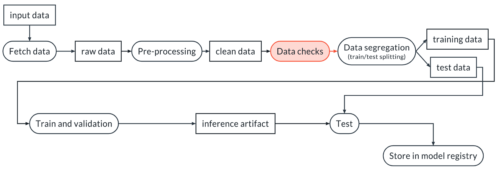
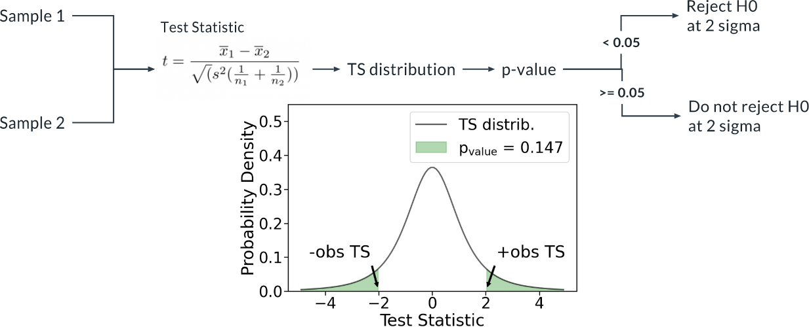

# Data Validation

In this lesson, we are going to talk about data validation. Data validation is a very important step, especially in the context of MLops where we want to automate our ML pipelines. You want to avoid bad data getting into your ML pipeline, because you might get a model in output, but that model will not work as expected.

You will learn how to:

- Write tests with pytest, both deterministic and non-deterministic
- Use fixtures to share data between tests
- Use `conftest.py` to add options to the command line of pytest so you can pass parameters and use it within components of ML pipelines

**Big Picture: Why You Need Data Validation**

We perform data validation in order to verify that our assumptions about the data are correct and stay correct even for new datasets. This latter point is not guaranteed. Indeed, the data can change for many reasons:

    Bugs are introduced upstream (for example in ETL pipelines)
    Changes in the source of the data are not communicated properly and produce unexpected changes in the input data
    The world changes and the distribution of the input data changes

Let's see some examples of the 3 cases:

    Due to a bug in an upstream data ingestion pipeline, the target of a regression model went from units of million of dollars to just dollars, so what used to be 1 is now 1,000,000. This is likely to require a different preprocessing step, for example a scaling stage
    The review we were tracking went from a 3 stars to a 10 stars rating system, and we weren't alerted of the change
    Remote working is now more widespread, consequently people are willing to buy houses much farther from their workplace. A model that predicts price will have to take that into account, and probably a new model will be necessary.

There are two possible places for the data checks: before or after the data segregation (of course you can also have two stages, one before and one after segregation). There are pros and cons for these solutions, but for the remaining of the class we will place the checks before the segregation:



### Primer on Pytest


Pytest is a tool to execute tests. It is very powerful, but we will only cover the features we need for this class. Please refer to the documentation for everything else.

Tests are collected in a directory, usually called `tests` and they are grouped into files. These files must have a name starting with `test_`, like `test_data.py` or `test_algorithm.py`.

Within each file you can have as many tests as you want. Each test is a function that again must start with `test_`. Within that function you can have one or more assertions, where you use the `assert` command to check that a condition is true. For example, say that we want to test that `a=b`. We can write:

```
assert a==b, "The value of a is different than the value of b"
```

which is equivalent to:

```
if not a==b:
  raise AssertionError("The value of a is different than the value of b")
```

Pytest will execute all the tests that it finds, and verify that all the assertions are true. If they are not, the corresponding test will fail.

An example of a test with `pytest` is then:

```
def test_data_length(data):
  """
  Test that we have at least 1000 rows
  """
  assert len(data)>1000
```

But what is `data` in this case?

**Fixtures**

In many cases tests need input data. This data can be provided using fixtures. Fixtures are special functions introduced by pytest. They must have the same name of the variable in the input of the test that they are supposed to fill. For example:

```
import pytest
import wandb

run = wandb.init()

@pytest.fixture(scope="session")
def data():

    local_path = run.use_artifact("my_project/artifact").file()
    df = pd.read_csv(local_path, low_memory=False)

    return df


def test_data_length(data):
    """
    We test that we have enough data to continue
    """
    assert len(data) > 1000
```

Here the `data` function downloads and reads a dataframe, then returns it. The value returned by the `data` function becomes the `data` input variable in the test. In practice, pytest does something similar to:

```
data_ = data()
test_data_length(data_)
```

The scope of the fixture can have a few legal values, described [here](https://docs.pytest.org/en/6.2.x/fixture.html#fixture-scopes). We are going to consider only `session` and `function`: with the former, the fixture is executed only once in a pytest session and the value it returns is used for all the tests that need it; with the latter, every test function gets a fresh copy of the data. This is useful if the tests modify the input in a way that make the other tests fail, for example.

Let's see this more closely:

**Example**

Let's consider this code:

```
import pytest
import wandb
import pandas as pd

run = wandb.init()

@pytest.fixture(scope="session")
def data():

    local_path = run.use_artifact("exercise_5/preprocessed_data.csv:latest").file()
    df = pd.read_csv(local_path, low_memory=False)

    return df


def test_data_length(data):
    """
    We test that we have enough data to continue
    """
    assert len(data) > 1000


def test_number_of_columns(data):
    """
    We test that we have enough data to continue
    """
    assert data.shape[1] == 19
```

Using scope="session" like we are doing is roughtly equivalent to calling the tests like:

```
data_ = data()
test_data_length(data)
test_number_of_columns(data)
```

Instead, using `scope="function"` would mean:

```
data_1 = data()
test_data_length(data_1)
data_2 = data() # Fresh copy
test_number_of_columns(data_2)
```

**Running the tests**

If the tests are within the `tests` directory, we can run all the tests with:

```
> pytest tests/ -vv
```
The `-vv` option means verbose, and it yields a more pleasant visualization of the results.

## Deterministic Tests

A data test is deterministic when it verifies attributes of the data that can be measured without uncertainty. Some examples are:

1. Numver of columns in a dataset
2. Length of the dataset
3. Distinct values in a categorical variable
4. Legal range for a numerical variable (for example, lenth > 10)
5. and more...

[Exercise 7 has good examples](exercise_7/starter/test_data.py)

## Non-Deterministic (Statistical) Tests

A test is non-deterministic when it involves measuring a quantity with intrinsic uncertainty (a random variable). For this reason, it involves Statistical Hypothesis Testing.

Most non-deterministic tests compare the present dataset with a previous one that is used as a reference.

Some examples of non-deterministic tests are:

- Check the mean and/or standard deviation of columns
- Check the level of correlations between columns, or a column and the target
- Check the distribution of values within one or more columns
- Check for outliers

Hypothesis testing

We are going to consider Frequentist Hypothesis Testing. In this statistical framework we have a null hypothesis and an alternative hypothesis. In our case, the null hypothesis represents our assumption about the data, while the alternative represents a violation of that assumption. For example, the null hypothesis could be "the two samples come from populations with a Normal distribution and equal means", and the alternative hypothesis could be "the two samples come from populations with a Normal distribution but different means":


In this case we consider the t-test. We consider the two samples, we compute the Test Statistic for the t-test, we compute the p-value and check if the p-value is larger or smaller than our pre-determined threshold. If it is larger, we do not reject the null hypothesis which means that our test passes. If it is smaller, we reject the null hypothesis. This does not necessarily mean that there is something wrong with our dataset (because depending on the threshold we used, the test has a probability of false positives that is not zero), but we should look at it closely:



We can apply a non-deterministic test using pytest and `scipy` like this:

```
import scipy.stats


def test_compatible_mean(sample1, sample2):
    """
    We check if the mean of the two samples is not
    significantly different
    """
    ts, p_value = scipy.stats.ttest_ind(
        sample1, sample2, equal_var=False, alternative="two-sided"
    )

    # Pre-determined threshold
    alpha = 0.05

    assert p_value >= alpha, "T-test rejected the null hyp. at the 2 sigma level"

    return ts, p_value
```

The function from `scipy` returns the p-value of the test, in this case the t-test. We just need to assert that such p-value is larger than the pre-determined threshold, so that the tests fails if that's not the case.

Once again, because we selected a threshold of 0.05, if we repeat the test on 100 different datasets we have an expectation of 5 false positives. As always, selecting the threshold is a balancing act between sensitivity of the test and number of false positives.

You also need to take into account the multiple-hypothesis testing problem, especially if you are applying the test on multiple columns. See [this blog post](https://towardsdatascience.com/precision-and-recall-trade-off-and-multiple-hypothesis-testing-family-wise-error-rate-vs-false-71a85057ca2b) for details and for strategies to account for that.

`scipy` contains many [statistical tests](https://docs.scipy.org/doc/scipy/reference/stats.html#statistical-tests). If the one we need is not there, we can also look at [statsmodels](https://www.statsmodels.org/stable/stats.html).

## Parameters in **Pytest**

We can introduce parameters to the pyteset command line by using the conftest.py file.

In this file we can add a special function called `pytest_addoption` and use a spencial fixture made available by `pytest`, called `parser`, like this:

```
def pytest_addoption(parser):
    parser.addoption("--input_artifact", action="store")
```

The `.addoption` method of the `parser` object adds an option that is going to available on the command line. By having this code in `conftest.py` qw can now run pytest as:

```
> pytest. -vv --input_artifact ecample/my_artifact:latest
```

We can now use that option value in tests and other fixtures. This is an example where we modify the `data` fixture we have seen before tto use the value of the `--inpurt_artifact` option:

```
import pytest
import pandas as pd

def pytest_addoption(parser):
    parser.addoption("--input_artifact", action="store")

@pytest.fixture(scope="session"
def data(request):
    input_artifact = request.config.option.input_artifact
    if input_artifact is None:
        pytest.fail("--input_artifact missing on command line")
    local_path = run.use_artifact(input_artifact).file()
    return pd.read_csv(local_path)
```

## Other Tools: Great Expectations

[Great Expectations](https://greatexpectations.io/) is an alternative tool to validate, document, and profile your data. It provides:

- A rich set of pre-defined tests
- Automatic profiling: it can generate a set of tests based on an input dataset, that can then be applied to a different dataset
- HTML reports showing histograms and other useful information about the dataset

However, it has a pretty steep learning curve.

## Glossary 
**Alternative Hypothesis:** In statistical hypothesis testing, the alternative hypothesis is a statement that contradicts the null hypothesis.

**Deterministic Test: **A test that involves a measurement without randomness. For example, measuring the number of columns in a table.

**ETL Pipelines:** Extract Transform Load pipelines. They are a classic structure for data pipelines. An ETL pipeline is used to fetch, preprocess and store a dataset.

**Hypothesis Testing:** A statistical method to test a null hypothesis against an alternative hypothesis. The main element of HT is a statistical test.

**Non-Deterministic Test:** A test that involves a measurement of a random variable, i.e., of a quantity with intrinsic randomness. Examples are the mean or standard deviation from a sample from a population. If you take two different samples, even from the same population, they will not have exactly the same mean and standard deviation. A non-deterministic test uses a statistical test to determine whether an assumption about the data is likely to have been violated.

**Null Hypothesis:** In statistical hypothesis testing, the null hypothesis is the assumption that we want to test. For example, in case of the t-test the null hypothesis is that the two samples have the same mean.

**P-Value:** The probability of measuring by chance a value for the Test Statistic equal or more extreme than the one observed in the data assuming that the null hypothesis is true.

**Statistical Test:** An inference method to determine whether the observed data is likely or unlikely to occur if the null hypothesis is true. It typically requires the specification of an alternative hypothesis, so that a Test Statistic (TS) can be formulated and the expected distribution of TS under the null hypothesis can be derived. A statistical test is characterized by a false positive rate alpha (probability of Type I error) and a false negative rate beta (probability of a Type II error). There are many statistical tests available, depending on the null and the alternative hypothesis that we want to probe.

**Test Statistic:** A random variable that can be computed from the data. The formula for the TS is specified by the appropriate statistical test that can be chosen once a null hypothesis and an alternative hypothesis have been formulated. For example, to test whether two samples have the same mean (null hypothesis) or a different mean (alternative hypothesis) we can use the t-test. The t-test specifies how to compute the TS appropriate for this case, as well as what is the expected distribution of TS under the null hypothesis.
