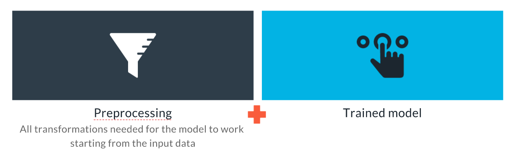
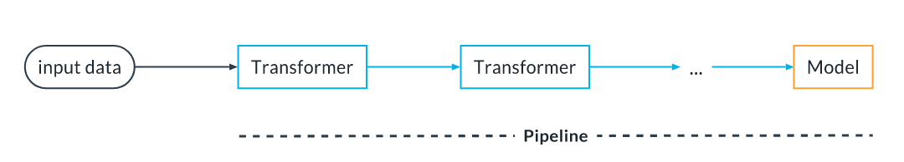
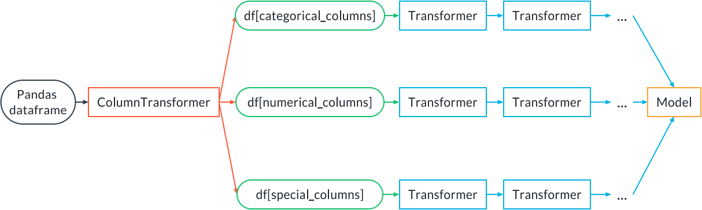
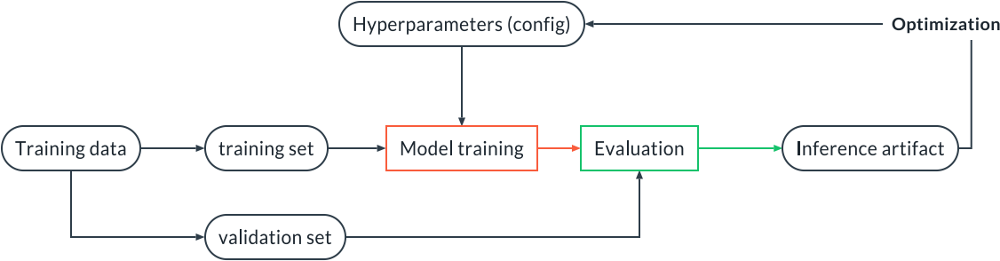

# Training, Validation and Experiment Tracking


1. What is an inference pipeline, and how to create one
2. How to conduct experiments in an ordered and reproducible way
3. How to test our final inference artifact
4. Options for deployment of our inference artifact

## The Inference Pipeline

We are going to talk now about the product of the train and validation step. Let's start with this definition:

- An inference pipeline is an ML pipeline that contains everything that needs to run in production at inference time: a pre-processing step that transforms the data input to the data expected by the model, and then the model.
- An inference artifact is a serialized (i.e., saved to disk) static version of the inference pipeline containing the preprocessing as well as a trained model.

--- 

Using an inference pipeline and an inference artifact helps us achieve development/production symmetry because the code that executes the preprocessing during training is the same code that does the preprocessing in production.

So, summarizing, this is what an inference artifact looks like:



## Write a Training/Inference Sub-Pipeline

And inference popeline using scikit-learn looks like this:



It is a sequence of *Transformers*, which receive the input and transform it in some way, followed by a model that receives the transformed input and returns an output (a classification or a regression prediction). The term transformers here has nothing to do with the transformers widely used in NLP modeling. Instead, transformers are objects that transform the input data, for example by encoding categorical features or renormalizing numerical features.

The pipeline can be fitted in one go. Suppose we have a pipeline with two transformers, transformer A and transformer B, and then a model C. Sklearn will fit A, then use A to transform the input training data and use the result to train B. Then the data will be transformed by B and finally fed to the model C for training.

The pipeline can also be deployed as a whole. At inference time, the input data will go through A, then the result will go through B, and finally through C to get the final inference.

Let's see how to implement such a pipeline with sklearn. Let's assume transformer A is an imputer (to impute missing values), transformer B is a scaler and the model C is a Logistic Regression model:

```
from sklearn.preprocessing import StandardScaler
from sklearn.impute import SimpleImputer
from sklearn.linear_model import LogisticRegression
from sklearn.pipeline import Pipeline, make_pipeline

pipe = Pipeline(
  steps=[
    ("imputer", SimpleImputer()),
    ("scaler", StandardScaler()),
    ("model", LogisticRegression())
  ]
)

# OR
pipe = make_pipeline(SimpleImputer(), StandardScaler(), LogisticRegression())
```
Now the pipeline can be fit at once with:

```
pipe.fit(X_train, y_train)
```

and used for inference: 

```
pipe.predict(X_test)
pipe.predict_proba(X_test)
```

A pipeline can be a lot more complex than this, of course.

Sometimes we want to apply a different preprocessing to groups of columns in a dataframe. For that we can use the `ColumnTransformer` class in sklearn:



**Demo: ColumnTransformer**

Here we use the `ColumnTransformer` to apply different preprocessing steps to numerical, textual and categorical columns:

```
import pandas as pd
from sklearn.compose import ColumnTransformer
from sklearn.feature_extraction.text import TfidfVectorizer
from sklearn.preprocessing import StandardScaler, OneHotEncoder
from sklearn.impute import SimpleImputer
from sklearn.linear_model import LogisticRegression
from sklearn.pipeline import make_pipeline


# Example dataframe from the sklearn docs
df = pd.DataFrame(
    {'city': ['London', 'London', 'Paris', 'Sallisaw'],
     'title': ["His Last Bow", "How Watson Learned the Trick",
               "A Moveable Feast", "The Grapes of Wrath"],
     'expert_rating': [5, 3, 4, 5],
     'user_rating': [4, 5, 4, 3],
     'click': ['yes', 'no', 'no', 'yes']})
y = df.pop("click")
X = df

# Build a Column transformer
categorical_preproc = OneHotEncoder()
text_preproc = TfidfVectorizer()
numerical_preprocessing = make_pipeline(SimpleImputer(), StandardScaler())
preproc = ColumnTransformer(
    transformers=[
        ("cat_transform", categorical_preproc, ['city']),
        ("text_transform", text_preproc, 'title'),
        ("num_transform", numerical_preprocessing, ['expert_rating', 'user_rating'])
    ],
    remainder='drop'
)
pipe = make_pipeline(preproc, LogisticRegression())
pipe.fit(X, y)
```

**Inference Pipeline with PyTorch**

f you want to run this example, you can get the related files at the bottom of this page.

```
import torch
from torchvision import transforms
from torch.nn import Sequential, Softmax
from PIL import Image
import numpy as np

# Get a pre-trained model
model = torch.hub.load('pytorch/vision:v0.9.0', 'resnet18', pretrained=True)
model.eval()

# Define the inference pipeline
pipe = Sequential(
    # NOTE: for the pipeline to be scriptable with script,
    # you must use a list [256, 256] instead of just one number (256)
    transforms.Resize([256, 256]),
    transforms.CenterCrop([224, 224]),
    transforms.Normalize(mean=[0.485, 0.456, 0.406], std=[0.229, 0.224, 0.225]),
    model,
    Softmax(1)
)

# Save inference artifact using torch.script
scripted = torch.jit.script(pipe)
scripted.save("inference_artifact.pt")

# NOTE: normally we would upload it to the artifact store

# Load inference artifact
pipe_reload = torch.jit.load("inference_artifact.pt")

# Load one example
# NOTE: these operations are usually taken care by the inference
# engine
img = Image.open("dog.jpg")
img.load()
# Make into a batch of 1 element
data = transforms.ToTensor()(np.asarray(img, dtype="uint8").copy()).unsqueeze(0)

# Perform inference
with torch.no_grad():
    logits = pipe_reload(data).detach()

proba = logits[0]

# Transform to class and print answer
with open("imagenet_classes.txt", "r") as f:
    classes = [s.strip() for s in f.readlines()]
print(f"Classification: {classes[proba.argmax()]}")
```

---
 ## Big Picture: Machine Learning Experimentation

Developing an ML pipeline is an iterative process made of trials and errors. In order to avoid chaos we need to:

- Assume we are going to iterate a lot
- Give ourselves the time to iterate (reasonable deadlines)
- Be systematic (if possible, change one thing at the time to keep an intuition of causality)
- Learn from every trial
- Be clear on our objectives and stop once we reach them

So how do we bring order exactly?

- Version our data
- Version our code
- Track every experiment

With these 3 key steps in place, we can perform experimentation following this process:



We start from the training data, split it into training and validation, and then train the model with a certain set of hyperparameters. We evaluate the trained model against the validation set and store the inference artifact in the artifact tracking store. We track the input data, the hyperparameters used, the code of the model (and all of its dependencies), as well as all the produced artifacts. With all of these elements, each experiment is reproducible.

Note: In many cases, algorithms and processes have randomness to them. In order to make the experiment reproducible and obtain the same results, we need to fix the state of the random number generators. For example, when splitting training and validation, we must assign a random seed or a random state so that the split will always return the same dataset. We need to do the same for algorithms like Random Forests where there is randomness in the algorithm. Failing to do so will make the experiment non-reproducible, not even running the same code with the same data and the same settings.


---
## Demo: Experiment Tracking in W&B

In order to track anything in W&B we need to create a run:

```
import wandb

run = wandb.init(project="tracking_demo")
```

Track the configuration of a run (hyperparameters)

We should put in the configuration all the input parameters that stay constant during the run (hyperparameter):

```
run.config.update(
  {
    "batch_size": 128,
    "weight_decay": 0.01,
    # NOTE that we can use nested structures
    "augmentations": {
      "rot_angle": 45,
      "crop_size": 224
    }
  }
)
```

If our script is using argparse, we can also say (assuming `args` is the result of `parse_args`):

```
run.config.update(args)
```

**Tracking scores, metrics and results**

To track a score, i.e. a final number that is a score for the run, we can use the `.summary` dictionary within the run instance:

```
run.summary['accuracy'] = 0.9
```

Instead, to track something that changes with time we can use the `.log` method. For example:

```
for i in range(10):
  run.log(
    {
      # Make up something that varies with the iteration
      "loss": 1.2 - i*0.1
    }
  )
```

This will produce a line plot in W&B with the value of loss varying with the iteration. We can also track multiple things at once:

```
for i in range(10):
  run.log(
    {
      # Make up something that varies with the iteration
      "loss": 1.2 - i*0.1
      "recall": 0.8 + i * 0.01
    }
  )
```

If we want to personalize the x-axis of the line plot, we can just track the x value we want to associate with a certain y value:

```
for i in range(10):
  run.log(
    {
      # Make up something that varies with the iteration
      "loss": 1.2 - i*0.1
      "epoch": i
    }
  )
```

and now we can set the x-axis of the plot in W&B to "epoch".
Logging Figures & Viewing Metrics

Assuming that the figure to track is in a matplotlib figure `fig` we can store it on W&B by doing:

```
run.log(
  {
    "my_figure": wandb.Image(fig)
  }
)
```

If we install `plotly` in our environment, we might not need `wandb.Image` and can just log `fig` directly.

---
## Demo: Hydra Sweeps (Hyperparameters Optimization)

Let's consider a dummy pipeline with two parameters, a and b:

Hydra can be used to perform parameter sweeps: given a grid of parameter values, hydra will generate multiple jobs and go through the grid automatically.

**Starting a Sweep**

If we want Hydra to do a sweep, we need to specify the values we want to explore and then the options `-m` ("multi-run"). So for example:

```
> mlflow run . -P hydra_options="-m parameters.a=3,4,5"
```

will generate 3 runs. The first one will have `a=3`, the second `a=4` and the third `a=5`.

**Multiple Parameters**

Of course, we can step through multiple parameters and generate a grid:

```
> mlflow run . -P hydra_options="-m parameters.a=3,4 parameters.b=2,3,4"
```

This will generate 6 runs: (a=3, b=2), (a=4, b=2), (a=3, b=3), (a=4, b=3), (a=3, b=4), (a=4, b=4). This can also be expressed using the `range()` syntax of Hydra:

```
> mlflow run . -P hydra_options="-m parameters.a=3,4 parameters.b=range(2,4,1)"
```

`range(2,4,1)` means "generate a range from 2 to 4 in increments of 1".

**Note:** when you use `range()` remember NOT to use any space. So `range(2,4,1)` works but `range(2, 4, 1)` does NOT work.

If we want our jobs to run in parallel, we can just add the `hydra/launcher=joblib` specification, like:

```
> mlflow run . -P hydra_options="hydra/launcher=joblib parameters.a=3,4 parameters.b=range(2,4,1) -m"
```

Hydra supports also more sophisticated algorithms than grid search. Refer to the [sweepers documentation](https://hydra.cc/docs/plugins/ax_sweeper) to find out more.

**Note**: MLflow imposes a limit on the length of each option string of 250 characters. Sometimes if you are changing several parameters you might hit that limit on the command line. You can solve this problem by putting your ranges directly in the configuration file (remember to make a copy of the original so you can always revert back) and then run without any parameter override.

---
## Demo: Choose the Best Performing Model

After running our experiments we can go to W&B and use the tabular view to sort our experiments using the metric we are interested in. For example, if we care about accuracy, we can select that column in the table visualization and sort it in descending order, so that the run with the highest accuracy is at the top. We can then click on that run and explore its configuration and all the other things that we tracked, including all the information we need to reproduce the run if needed.

---
## Export Your Model Sub-Pipeline

Exporting means packaging our inference pipeline into a format that can be saved to disk and reused by downstream tasks, for example our production environment.

We can export our inference pipeline/model using `mlflow`. MLflow provides a standard format for model exports that is accepted by many downstream tools. Each export can contain multiple *flavors* for the same model. A flavor is a particular subformat for the model. A downstream tools could support some flavors but not others. Of course, the exported artifact can also be re-read by mlflow. Finally, the export contains also all the information to recreate the environment for the model with all the right versions of all the dependencies.

MLflow provides [several flavors](https://www.mlflow.org/docs/latest/models.html#built-in-model-flavors) out of the box, and can natively export models from sklearn, pytorch, Keras, ONNX and also a generic python function flavor that can be used for custom things.

When generating the model export we can provide two optional but important elements:

1. A signature, which contains the input and output schema for the data. This allows downstream tools to catch obvious schema problems.
2. Some input examples: these are invaluable for testing that everything works in downstream task

Normally MLflow figures out automatically the environment that the model need to work appropriately. However, this environment can also be [explicitly controlled](https://www.mlflow.org/docs/latest/python_api/mlflow.sklearn.html#mlflow.sklearn.save_model). Finally, the exported model can be [easily converted](https://www.mlflow.org/docs/latest/models.html#deploy-mlflow-models) to a Docker image that provides a REST API for the model.

Let's assume we have some sort of pipeline:

```
from sklearn.pipeline import Pipeline
import mlflow.sklearn
from mlflow.models import infer_signature

# Define and fit pipeline
pipe = Pipeline(...)
pipe.fit(X_train, y_train)
pred = pipe.predict(X_test)
```

The signature of the inference artifact can be inferred from the data and from the predictions of the pipeline:

```
signature = infer_signature(X_test, pred)
```

Now we can export the inference artifact:

```
# Get signature and export inference artifact
export_path = "model_dir"

mlflow.sklearn.save_model(
  pipe,  # our pipeline
  export_path,  # Path to a directory for the produced package
  signature=signature, # input and output schema
  input_example=X_test.iloc[:5]  # the first few examples
)
```

Then, we can upload the created artifact as usual:

```
artifact = wandb.Artifact(...)
# NOTE that we use .add_dir and not .add_file
# because the export directory contains several
# files
artifact.add_dir(export_path)
run.log_artifact(artifact)
```

---
 ## Test Your Final Artifact and Mark for Production
 
 We evaluate the inference artifact against the test dataset *after* export, i.e., we load the exported inference artifact in a different component (the test component) and we evaluate its performances. We do this so we are testing exactly what will be used in production.

Thus, within the component evaluating the inference artifact we can do:

```
model_export_path = run.use_artifact(args.model_export).download()

pipe = mlflow.sklearn.load_model(model_export_path)
```

to load the inference artifact. Note that the model export artifact (aka the inference artifact) contains several files, so we need the path to the directory containing the files. Therefore, we use `.download()` and not `file()` as we did so far.

Once we have reloaded our pipeline, we can test it as usual, for example computing the ROC metric:

```
pred_proba = pipe.predict_proba(X_test)
score = roc_auc_score(y_test, pred_proba, average="macro", multi_class="ovo")
run.summary["AUC"] = score
```

**Demo: Mark for Production**

For every experiment we are exporting the model and tracking that artifact in W&B. When we have selected the best-performing model among all the experiments we have performed we can therefore navigate to the inference artifact for that run and mark it as "production ready". In W&B, this can be accomplished for example by adding the tag `prod` for that artifact version. Only one version of the artifact can have a certain tag, so the one we marked for production is going to be the only one with that label. We can therefore refer to it, like in `model_export:prod`.

---
## Using MLflow for Experiment Tracking

MLflow provides MLflow tracking that accomplishes a similar function as the experiment tracking capability of W&B. It can track artifacts, code and experiments. The way artifacts are tracked though is pretty different than W&B, and more primitive. You can find a description on how to use this functionality here. Tracking experiments is very similar to what W&B does:

```
experiment_id = mlflow.create_experiment("experiment 1")
with mlflow.run() as run:
  # Log an hyper parameter
  run.log_param("param1", 100)
  # Log a metric
  for i in range(10):
    run.log_metric("foo", i)
  # Log an artifact
  path_to_my_artifact = "./my_artifact.csv"
  run.log_artifacts(path_to_my_artifact)
```

**Note:** The free version of MLflow, not attached to a Databricks instance, does not support user authentication and management out of the box, which makes it not very useful for teams (but good for personal use).

---
## Conclusion


- The inference pipeline and the inference artifact: what they are and why are they used
- How to perform an ordered experimentation phase, keeping track of and versioning data, code and hyper-parameters
- How to create an inference pipeline with sklearn and export it with MLflow and scikit-learn (and a quick example with pytorch)
- How to evaluate the inference artifact against the test dataset

**Glossary**

**Experiment Tracking:** The process of recording all the necessary pieces of information needed to inspect and reproduce a run. We need to track the code and its version, the dependencies and their versions, all the metrics of interests, all the produced artifacts (images, model exports, etc.), as well as the environment where the experiment runs.

**Hyperparameter Optimization:** The process of varying one or more hyperparameter of a run in order to optimize a metric of interest (for example, Accuracy or Mean Absolute Error).

**Inference Artifact:** An instance of the Inference Pipeline containing a trained model.

**Inference Pipeline:** A pipeline constituted of two steps: the pre-processing step and the model. The pre-processing step can be a pipeline on its own, and it manipulates the data and prepares them for the model. The inference pipeline should contain all the pre-processing that needs to happen during model development as well as during production. When the inference pipeline is trained (i.e., it contains a trained model) it can be exported to disk. The export product is called an Inference Artifact.

Remove excess MLFlow conda envs:
```
 #!/bin/bash
 
 echo "Removing all conda environments with prefix 'mlflow-'"
 
 conda env list | cut -d " " -f1 | while read -r env ; do
     echo "Processing $env"
     if [[ $env == mlflow-* ]]; then
         conda env remove -n $env
     fi  
 done
```


