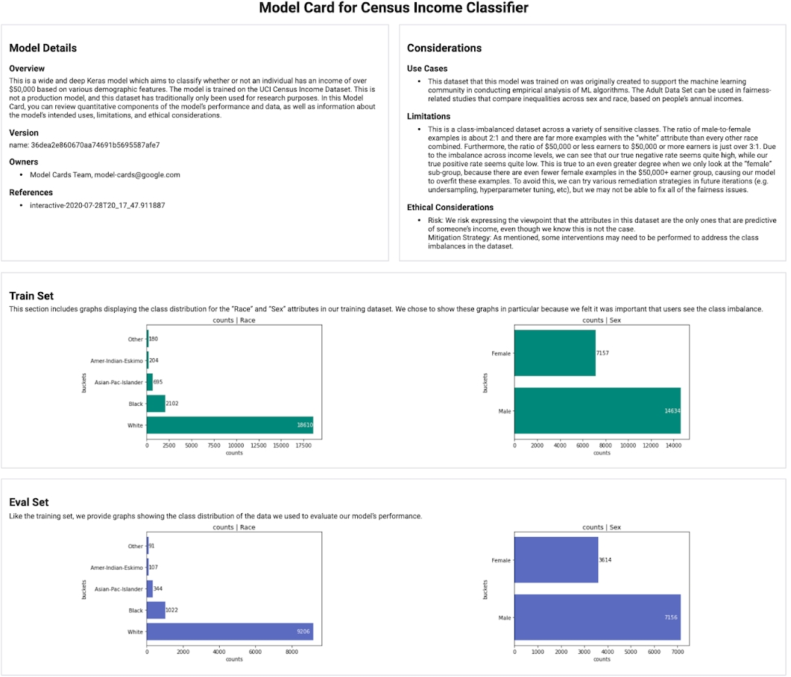

Introduction

In this lesson, we will cover performance testing and preparing a model for production.

You have put an immense amount of work creating a model by writing clean code with a robust reproducible work flow. Now we want to put the cherry on top and check our performance a few additional ways with **slices**, check for **bias**, and lastly deliver the final model with a **model card** that explains its origin, purpose, and any caveats.

- Review Validation Sets and K-Fold Cross-Validation
- Data Slicing
- Data Slicing Use Cases and Testing
- Model Bias
- The Aequitas Package
- Model Cards

## Review of Validation Set and K-Fold Cross-Validation

Validation set and K-Fold Cross-Validation (CV) are methods for evaluating overall model performance.

**Validation Set**

In this approach, we split the training data into a train and validation set. The validation set is used to make decisions on what model to use before finally applying it to a final test set. Commonly, the validation set is between 10-30% of your overall data, but often it can be much less depending on data needs.

Conceptually this approach is simple and relatively fast. However, it means that your model does not get to see all the data when you train, and thus potentially leaves value on the table.

**K-Fold Cross-Validation**

In this method, we split the data into K sets. The model is trained on K-1 then validated on the last. This process occurs K times, each time changing which fold is held out. The final validation score is the average of the metric on each fold. This leads to a more reliable measure of the performance metric since it minimizes the chance of an unlucky validation set that may not fully represent the data.

This approach allows your model to see all of the data since the set that is being held out changes on every iteration. However, this is computationally expensive since you must now train your model K times (albeit on a smaller data set size). Due to the cost, typically, K-Fold CV is not used for training neural networks, and instead, a validation set is used.

## Data Slicing Introduction

**Data slicing** is when we compute the metrics of our model holding a certain feature fixed.

For example, imagine an image classification model trained to recognize different animals. In general, we want to know the model's overall performance, but we may also want to know specifically how well it does on each class. For instance, if the model performs really well on dogs, wolves, and coyotes but performs poorly on cats, lions and tigers then that would indicate a problem. Furthermore, if our data was oversampled towards canines then we might not even notice the underperformance for felines if we were to look at the overall metrics.

Typical model validation such as validation sets and K-Fold Cross-Validation can be thought of as looking at **horizontal slices** of the data, i.e. an overall view of the data and performance. Data slicing can be thought of as looking at **vertical slices** of the data. This is by no means a rigorous distinction but is helpful to keep in mind.

Further Reading

See Slice Finder: [Automated Data Slicing for Model Validation](https://ieeexplore.ieee.org/document/8731353) for research on an automated approach to identify interpretable and informative slices.

## Data Slicing Use Cases

Data slicing should be used in the model validation process before deploying a model. Just as you would verify overall performance, you should verify performance on all relevant slices. What counts as "relevant" is highly dependent on the type of model/data, and the domain. For example, slicing on the specialty of medical providers in a disease predictor, or race and gender in a recidivism (repeated criminal offenses) predictor.

The same slices that you monitor pre-deployment should also be monitored post-deployment. Of course in post-deployment, you will not have labels to compute exact metrics, but given enough examples, one can compute the output values on a given slice like classification probability and see if it is statistically similar to the same classification probability on the training data.

While it's beyond the scope of this course, there is a growing field of "slice-based learning" (linked in the further reading). Understanding how your model performs on a more granular level can potentially open opportunities for further model developments.

**Further Reading**

To dig into more on the growing field of slice-based learning see:

[Slice-based Learning: A Programming Model for Residual Learning in Critical Data Slices](https://papers.nips.cc/paper/2019/file/351869bde8b9d6ad1e3090bd173f600d-Paper.pdf)
[The Snorkel blog on slice-based learning](https://www.snorkel.org/blog/slicing)

## Unit Testing for Slice-Validation

In the previous sections, we discussed why and when you would compute metrics on data slices. For how, you should use unit tests. Just as with overall model performance, checking performance on slices is an iterative process that is done throughout model development and post-deployment. By writing unit tests we can leverage the software engineering principles that we will cover in lesson 3. Unit tests that are run automatically means we will never accidentally deploy a model that underperforms on a slice that previously performed well.


**Demo Code**

foo.py

```
def foo():
    return "Hello world!"
```

test_foo.py

```
from .foo import foo

def test_foo():
    foo_result = foo()

    expected_foo_result = "Hello world!"
    assert foo_result == expected_foo_result
```

test_slice.py

```
import pandas as pd
import pytest


@pytest.fixture
def data():
    """ Simple function to generate some fake Pandas data."""
    df = pd.DataFrame(
        {
            "id": [1, 2, 3],
            "numeric_feat": [3.14, 2.72, 1.62],
            "categorical_feat": ["dog", "dog", "cat"],
        }
    )
    return df


def test_data_shape(data):
    """ If your data is assumed to have no null values then this is a valid test. """
    assert data.shape == data.dropna().shape, "Dropping null changes shape."


def test_slice_averages(data):
    """ Test to see if our mean per categorical slice is in the range 1.5 to 2.5."""
    for cat_feat in data["categorical_feat"].unique():
        avg_value = data[data["categorical_feat"] == cat_feat]["numeric_feat"].mean()
        assert (
            2.5 > avg_value > 1.5
        ), f"For {cat_feat}, average of {avg_value} not between 2.5 and 3.5."

```

## Investigating Model Bias: Overview

Commonly, a model may perform well overall but underperform on some slices. Or, insidiously, a model may perform well by every metric you throw at it but still underperform in application. There are many reasons this could happen, but one culprit that has been gaining increased awareness is **data bias**. This is not to be confused with the bias in "bias-variance trade-off" which is part of the model under or overfitting and model generalization.

Data bias can come from a multitude of sources such as human error. A few examples are

- sampling error - when there is a mismatch between the sample and the intended population, one cause can be too small of a sample or using a biased method of collection.
- exclusion bias - exclusion of a group from a survey, it could arise from survey methods (such as only using in-person surveys) or perhaps only collecting data from a platform that certain age-groups frequent when instead an all-age sample is desired.
- recall bias - the human error that occurs when people are asked to recall events from the past. Data could be unreliable or clouded by external perspective.

Data bias can also be more systemic and stem from society-level errors such as unjust and unfair systems or stereotypes.

**Data bias can arise during data collection, data annotation, and/or data preprocessing.**

**Further reading**

For some further context, see [IBM's](https://developer.ibm.com/articles/machine-learning-and-bias/) article on bias in machine learning.

## Investigating Model Bias: The Aequitas Package

Data bias can take many forms and have many ramifications. There are a growing number of tools to classify, understand, and mitigate data bias such as What-If Tool, FairLearn, FairML, and Aequitas. Here, we will focus on Aequitas. Note, these tools are typically separate from model explainability tools such as SHAP and LIME.

Aequitas is used to create a bias audit report using the webapp, CLI, or Python package. In Aequitas you specify the score, label, and at least one categorical (or bucketed numerical) field and then three reports are created comparing against a reference group (often the majority). The three reports are

1. Group Metrics Results
2. Bias Metrics Results
3. Fairness Measures Results

and collectively drill down in increasing levels of granular detail.

**Further Reading**

The [Aequitas website](http://aequitas.dssg.io/) where more information and a link to the documentation can be found.

## Model Cards

Model Card

Model cards are a succinct approach for documenting the **creation**, **use**, and **shortcomings** of a model. They should be written such that a non-expert can understand the model card's contents.

There is no one way to write a model card! Suggested sections include:

1. Model Details such as who made it, type of model, training/hyperparameter details, and links to any additional documentation like a paper reference.
2. Intended use for the model and the intended users.
3. Metrics of how the model performs. Include overall performance and also key slices. A figure or two can convey a lot.
4. Data including the training and validation data. How it was acquired and processed.
5. Bias inherent either in data or model. This could also be included in the metrics or data section.
6. Caveats, if there are any.


Source: [Tensorflow's Model Card Toolkit](https://www.tensorflow.org/responsible_ai/model_card_toolkit/guide#model-card-toolkit)


**Further Reading**

The [research paper](https://dl.acm.org/doi/10.1145/3287560.3287596) introducing the concept of Model Cards. (Also available as a preprint [here](https://arxiv.org/pdf/1810.03993.pdf))

Google's [general documentation](https://modelcards.withgoogle.com/about) on model cards.


## Sample Model Card

**Model Details**

Udacity created the model. It is logistic regression using the default hyperparameters in scikit-learn 0.24.2.

**Intended Use**

This model should be used to predict the acceptability of a car based off a handful of attributes. The users are prospective car buyers.

**Metrics**

The model was evaluated using F1 score. The value is 0.8960.

**Data**

The data was obtained from the UCI Machine Learning Repository (https://archive.ics.uci.edu/ml/datasets/Car+Evaluation). The target class was modified from four categories down to two: "unacc" and "acc", where "good" and "vgood" were mapped to "acc".

The original data set has 1728 rows, and a 75-25 split was used to break this into a train and test set. No stratification was done. To use the data for training a One Hot Encoder was used on the features and a label binarizer was used on the labels.

**Bias**

According to Aequitas bias is present at the unsupervised and supervised level. This implies an unfairness in the underlying data and also unfairness in the model. From Aequitas summary plot we see bias is present in only some of the features and is not consistent across metrics.

# Lesson Recap

In this lesson, we reviewed validation sets and K-Fold Cross-Validation. With that in mind, we went into **data slicing**, which is akin to looking to looking at vertical slices of the data that are focused instead of horizontal comprehensive slices. We also discussed how data always has the potential to be biased and looking at slices could help indicate this. Furthermore, there is a growing number of tools specifically designed for looking at **bias**, such as **Aequitas**. Lastly, we looked at **model cards** which provide a tidy way to provide documentation for a trained (and deployed) model.

- Review Validation Sets and K-Fold Cross-Validation
- Data Slicing
- Data Slicing Use Cases and Testing
- Model Bias
- The Aequitas Package
- Model Cards

