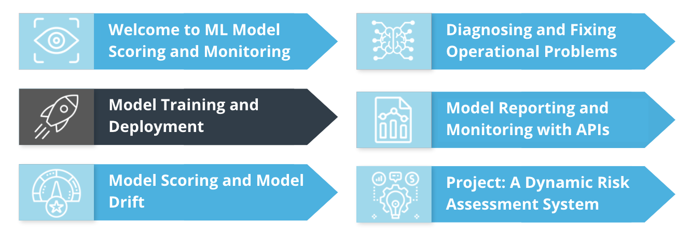
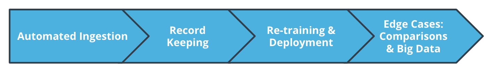
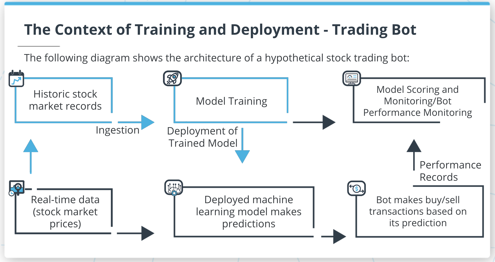
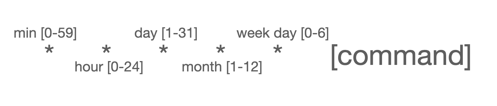
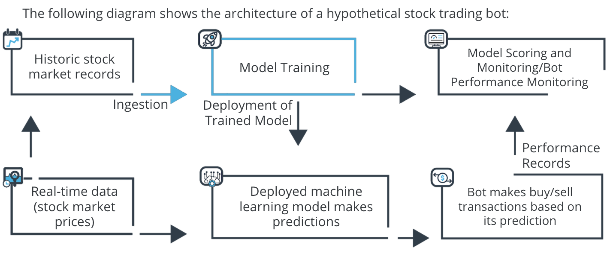
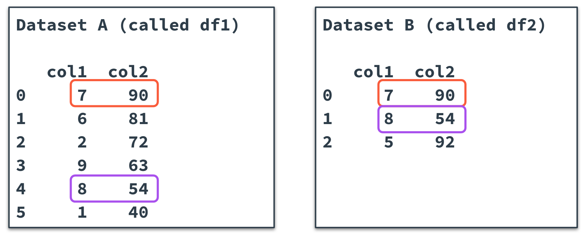
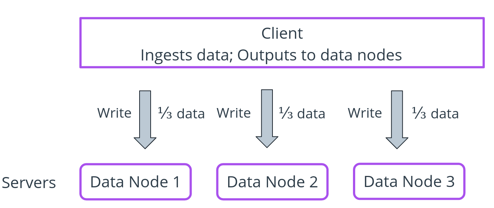
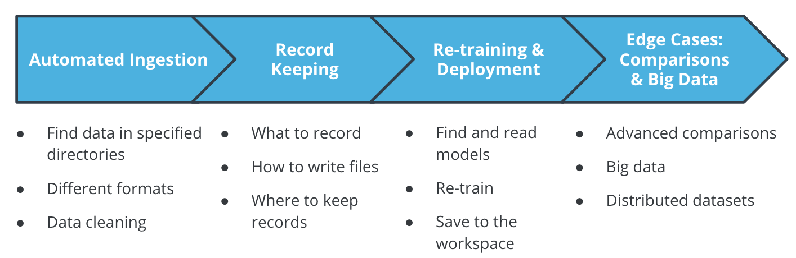

# Model Training and Deployment

**Introduction and Lesson Overview**

*Course Outline*


*Lesson Outline*

**Summary**

In this lesson, we'll focus on model training and deployment. We'll cover all of the following topics:

- Automated data ingestion: how to gather, compile, aggregate, clean, and output data for use in ML projects, including how to automate all processes
- Process record keeping: how to keep records of data ingestion and other ML project processes, and what to record
- Retraining and re-deployment: how to automatically retrain models and re-deploy them to production environments
- Advanced comparisons: how to make detailed comparisons between datasets, to determine observations that are shared in common or are duplicates
- Big data: how to work with extremely large datasets using distributed file systems and parallel processing

## Developing Your Intuition



**Summary**

To understand model training and deployment, consider a hypothetical ML project. In this project, we imagine a machine learning model that makes predictions about stock market data. A trading bot can use these predictions to make buy/sell transactions on the stock market.

To ensure this project runs well, you'll need to set up and maintain a few important operational components. The first thing you need to set up is **data ingestion**. You'll need data for making new predictions, and also for training and improving your model. Data ingestion will compile, clean, process, and output the data you need.

You'll also need to set up a process for **model retraining and re-deployment**. This is necessary to ensure that your model stays up-to-date and as accurate as possible.

You will also need to set up **model scoring and monitoring**.

In this lesson, we'll focus on *data ingestion and model retraining and re-deployment*. It's important to remember the steps described in the diagram above to understand the context of what we'll do in this lesson.


## Data Ingestion

**Summary**

You need to ingest data in order to perform machine learning. Data ingestion is the term for the process of finding, gathering, recording, cleaning, and providing data as input to an ML project.

- First, you need to **find data**. Your data might be in several different places, in different formats, with different sizes and update frequencies.
- Next, you need to **read** your data into a Python script, and **aggregate** all source datasets into one, combined dataset.
- You need to do **de-duplication** and **cleaning**.
- Finally, you need to **write** the dataset to a single output file or table.

There are some methods from the `os` module that can be useful as you're performing data ingestion:

- `os.getwcd()` gets the current working directory, which will enable you to search for files on your workspace.
- `os.listdir()` generates a list of filenames in a particular directory. This will help you know which files to read during your ingestion process.


The demo starts by importing some useful modules:
```
import os
import pandas as pd
```
Next, you can specify the directories where you will look for data:
```
directories=['/udacity1/','/udacity2/']
```
You need to instantiate an empty data frame with the right column names:
```
final_dataframe = pd.DataFrame(columns=['peratio','price'])
```
The heart of the demo is a for loop. It looks through all directories and finds all files in each directory. For every file it finds, it appends the file's data to the final_dataframe.
```
for directory in directories:
    filenames = os.listdir(os.getcwd()+directory)
    for each_filename in filenames:
        currentdf = pd.read_csv(os.getcwd()+directory+each_filename)
        final_dataframe=final_dataframe.append(currentdf).reset_index(drop=True)
```
Finally, you can write the full data frame to your workspace:
```
final_dataframe.to_csv('demo_20210330.csv')
```

**New Terms**

- `os`: a module you can use to access workspace directories and files from a Python script
- ingestion: the process of finding, gathering, recording, cleaning, and providing data as input to an ML project.

**Additional Resources**

    You can find papers related to data ingestion [here](https://www.sciencedirect.com/topics/computer-science/data-ingestion).

## Data Ingestion - Process Record Keeping

**Summary**

As you're doing data ingestion, you should make sure to document the details of your process. The following are ingestion details you'll want to keep records of:

- The name and location of every file you read as a source.
- The date when you performed data ingestion.
- The datasets you worked with
- Other details about the data, maybe including how many duplicates you dealt with, and how many formatting changes you made.
- The name and location of the final output file you wrote.

**Demo**

You can start the demo by importing the right modules:
```
import pandas as pd
from datetime import datetime
```
Next, you need to specify the location of your source data, a file name, and an output location where you'll write your records:
```
sourcelocation='./recorddatasource/'
filename='recordkeepingdemo.csv'
outputlocation='records.txt'
```
Next, you can read a csv at the location specified in the previously defined variables:
```
data=pd.read_csv(sourcelocation+filename)
```
In order to record the time of the latest ingestion process, you need to get a current timestamp:
```
dateTimeObj=datetime.now()
thetimenow=str(dateTimeObj.year)+ '/'+str(dateTimeObj.month)+ '/'+str(dateTimeObj.day)
```
You can compile all the relevant information into a single Python list:
```
allrecords=[sourcelocation,filename,len(data.index),thetimenow]
```
Finally, you can write the records to a file on your workspace:
```
MyFile=open(outputlocation,'w')
for element in allrecords:
     MyFile.write(str(element))
```

**New Terms**

- timestamp: a character string recording a particular date and time
- datetime: a module containing capabilities for recording timestamps

**Additional Resources**

You can read about outputting records in Python's official documentation [here](https://docs.python.org/3/tutorial/inputoutput.html).

## Automation Using Cron Jobs

**Summary**

It's very likely that you'll want to schedule Python scripts to run automatically at regular intervals. If you're using a Linux machine like your Udacity workspace, you can accomplish this using your machine's `crontab` file.

A crontab file contains rows of simple commands call cron jobs. Every cron job schedules a particular job or script to run at a particular regular interval. Cron jobs can run Python scripts, or any other command that can be run from the Linux command line.

Cron jobs are so important because they enable automation, and they reduce the manual intervention required in ML projects.

**Understanding cron jobs**

You can run `crontab -e` on the Linux command line to open the crontab file that contains your machine's cron jobs.

Every cron job begins with five numbers or asterisks that specify how frequently the job should be run. Take a look at the illustration below:

*The structure of a cron job: 5 numbers or asterisks representing the frequency of running, and the command to be run*

Every cron job needs to specify how frequently the job should be run. If you specify an asterisk, the job will be run at every interval. After specifying the frequency, you need to specify the command to run. This will become more clear in the following demo.

**Demo: Cron Job**

**Summary**

You can open your workspace and make sure that the cron service is running as follows:

```
service cron start
```

Next, you can open your machine's crontab:
```
crontab -e
```
After the crontab is open, you can add cron jobs to it. Each cron job is exactly one line long.

The following cron job will run every minute of every day:
```
* * * * * python /home/workspace/L2/demo1/crondemo.py
```
The following cron job will run at 12:59 on January 5, just once per year:
```
59 12 5 1 * python /home/workspace/L2/demo1/crondemo.py
```
The following cron job will run on Fridays, once per hour at 59 minutes past every hour:
```
59 * * *  5 python /home/workspace/L2/demo1/crondemo.py
```


**New Terms**

- crontab: the file on a Linux machine that contains cron jobs
- cron job: a one-line code snippet that schedules a particular task

**Additional Resources**

- You can find a useful cron job editor [here](https://crontab.guru/).
- You can read more about cron jobs [here](https://www.hostinger.com/tutorials/cron-job).

## Automated Model Re-training And Deployment

**Model Re-training And Deployment**

**Summary**

Re-training and re-deployment are important parts of every ML project. Take a look at the image below, showing a map of a full ML project. It shows data ingestion in the top left - this is something we did in the first part of this lesson. Training and deployment are shown in the middle of the top row - they're the steps we want to talk about now.



We accomplish training just after ingestion. Training requires you to know the location of ingested training data, create an ML model, and fit the model using the training data.

After training, you can accomplish deployment. Often, deployment is a simple process, that requires saving a trained model to a production environment.

**Remember**: every part of the training and deployment process can be automated by using cron jobs.

**Demo: Model Re-training And Deployment**

**Summary
**
Start by importing relevant modules:
```
import pickle
import pandas as pd
from sklearn.linear_model import LogisticRegression
import os
```
You need to open the file that contains the name of the deployed model:
```
with open('deployedmodelname.txt', 'r') as f:
    deployedname = f.read()
print(deployedname)
```
You also need to open the file that contains the location of the demo data:
```
with open('demodatalocation.txt', 'r') as f:
    datalocation = f.read()
print(datalocation)
```
Next, read the training data, and separate it into X and y variables:
```
trainingdata = pd.read_csv(os.getcwd() + datalocation)
X = trainingdata.loc[:,['bed','bath']].values.reshape(-1, 2)
y = trainingdata['highprice'].values.reshape(-1, 1).ravel()
```
Create a logistic regression model, and train it using our training data:
```
logit = LogisticRegression(C=1.0, 
                           class_weight=None, 
                           dual=False, 
                           fit_intercept=True, 
                           intercept_scaling=1, 
                           l1_ratio=None, 
                           max_iter=100,
                           multi_class='auto', 
                           n_jobs=None, 
                           penalty='l2',
                           random_state=0, 
                           solver='liblinear', 
                           tol=0.0001, 
                           verbose=0,
                           warm_start=False)
model = logit.fit(X, y)
```
Finally, save the pickle file to your workspace:
```
pickle.dump(model, open('./production/' + deployedname, 'wb'))
```
**New Terms**

- pickle: the module used to read and write trained ML models
- logistic regression: an ML method used for categorical (0-1) classifications
- re-deployment: the process of overwriting a deployed ML model with a newer, improved version
- dump(): the method in the pickle module used to save a trained ML model

**Additional Resources**

You can read more about model retraining and re-deployment [here](https://mlinproduction.com/model-retraining/#:~:text=Rather%20retraining%20simply%20refers%20to,t%20involve%20any%20code%20changes.).


## Edge Cases

**Advanced Data Comparisons**

**Summary**

Sometimes, when you're ingesting data from multiple sources, you want to do comparisons between the datasets, to find out which rows are shared in common between both datasets, and which rows are unique.

Sometimes, like in the image below, you can accomplish this comparison just by looking at the two datasets for a few seconds:

*Two small datasets, that can be compared merely by looking for a few seconds to check which rows are common to both*

For bigger datasets, it won't be practical to visually inspect every row. Instead, we want a code solution.

If you have two datasets, called df1 and df2, you can use this line of code to accomplish the comparison:
```
df_all = df1.merge(df2.drop_duplicates(),
                   on=['col1','col2'],
                   how='outer', 
                   indicator=True)
```
This will merge the two datasets together, and also create a new column called _merge, which will indicate whether each row is common to both datasets, or unique to only one.

**Big Data**

**Summary**

There are some special ways to work with extremely large datasets. Instead of ingesting them to a single file or even a single machine, we can split them into multiple sections, and save each section to a different machine. A system that spreads single datasets across multiple machines is called a **distributed file system.**

A typical distributed file system uses a model called a **client/server model**, illustrated in this image:


 *The client/server model: a client makes assignments to multiple servers, requiring them to store portions of datasets or run scripts*

After you split the data into several different parts and spread them across separate servers, you can use special techniques to perform calculations or operations. One of the most common methods for performing operations on distributed file systems is called MapReduce. MapReduce provides a framework for working with data on individual nodes and then combining the results. If you work with very large datasets, you should familiarize yourself with methods like these for working with distributed file systems.

**New Terms**

- **merge():** a method for combining two datasets - also including an option to record which entries are unique to particular datasets, and which are common across both
- **distributed file system**: a collection of machines that allow data to be spread across multiple locations, to make work with extremely large datasets more feasible
- **client/server model**: a hierarchical model allowing one machine to perform executive functions and control others, for more efficient data processing
- **MapReduce**: a framework for performing operations on distributed datasets

Additional Resources

- [This page](https://guides.nyu.edu/quant/merge) contains an overview of different ways to merge multiple datasets.
- [This tutorial](https://hci.stanford.edu/courses/cs448g/a2/files/map_reduce_tutorial.pdf) contains an introduction to MapReduce.
- [This page](https://www.geeksforgeeks.org/what-is-dfsdistributed-file-system/) contains more information about distributed file systems.


## Summary

This lesson was concerned with data ingestion and model training and deployment. In this lesson, we learned how to:

- automatically ingest data, for use in the model, and for model training
- keep records related to ML processes, including data ingestion
- automate ML processes using cron jobs
- retrain and re-deploy ML models

These skills are important for every ML project. It's crucial to be able to ingest new data that your model needs. It's just as crucial to retrain and re-deploy your model regularly to keep it up-to-date. Being able to keep records about processes and automate them will also be important throughout the rest of the course.



**Glossary**

For your reference, here are all the new terms we introduced in this lesson:

- **os**: a module you can use to access workspace directories and files from a Python script
- **ingestion**: the process of finding, gathering, recording, cleaning, and providing data as input to an ML project.
- **timestamp**: a character string recording a particular date and time
- **datetime**: a module containing capabilities for recording timestamps
- **crontab**: the file on a Linux machine that contains cron jobs
- **cron job**: a one-line code snippet that schedules a particular task
- **pickle**: the module used to read and write trained ML models
- **logistic regression**: an ML method used for categorical (0-1) classifications
- **re-deployment**: the process of overwriting a deployed ML model with a newer, improved version
- **dump()**: the method in the pickle module used to save a trained ML model
- **merge()**: a method for combining two datasets - also including an option to record which entries are unique to particular datasets, and which are common across both
- **distributed file system**: a collection of machines that allow data to be spread across multiple locations, to make work with extremely large datasets more feasible
- **client/server model**: a hierarchical model allowing one machine to perform executive functions and control others, for more efficient data processing
- **MapReduce**: a framework for performing operations on distributed datasets

