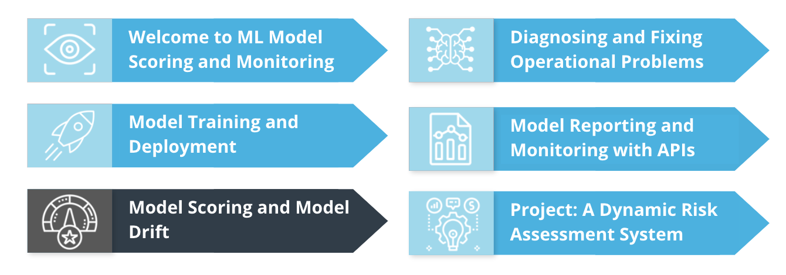
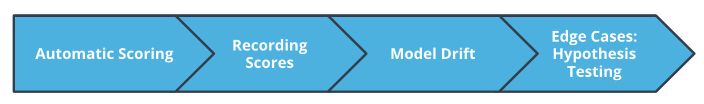
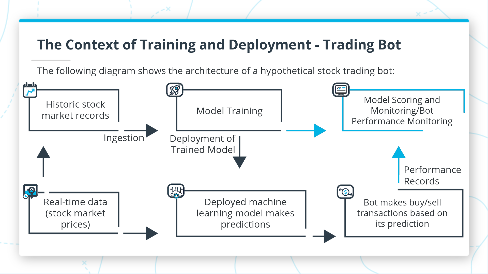
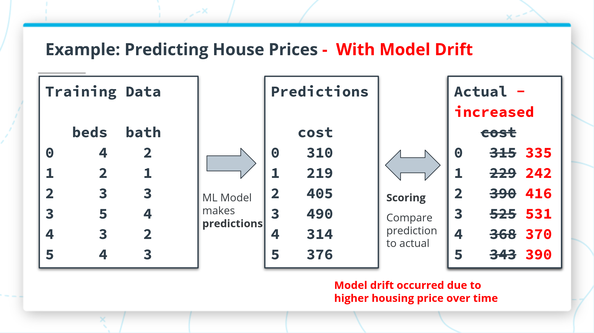
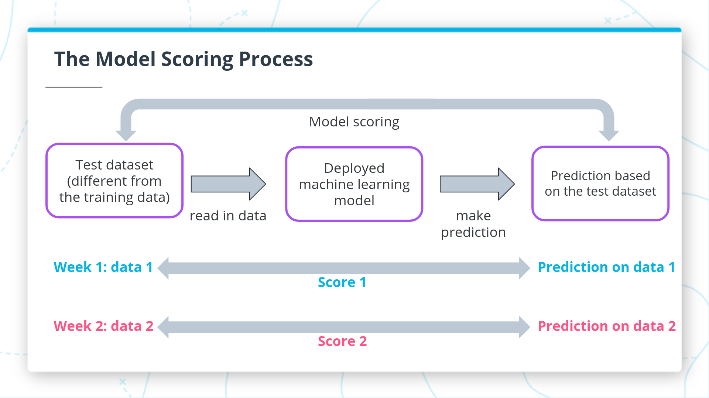
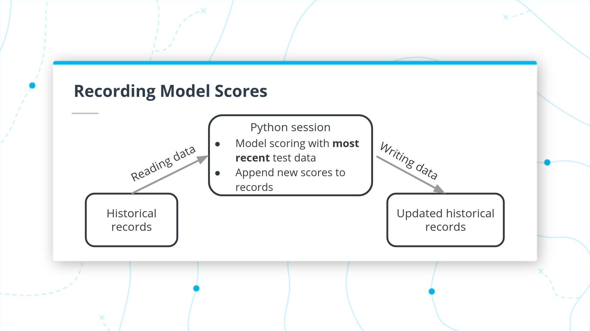
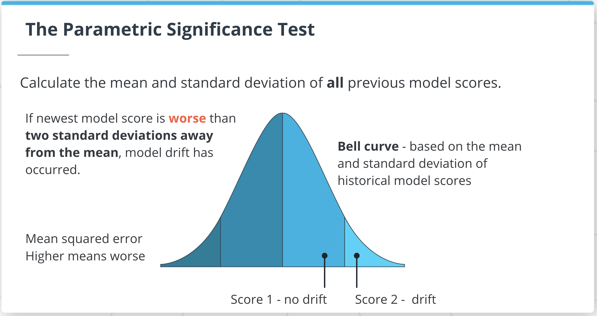
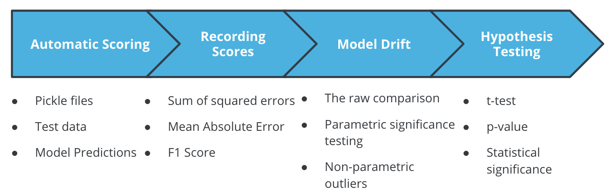

# Model Scoring and Model Drift





**Summary**

Welcome to our lesson on Model Scoring and Model Drift!

It's common to score models before deployment, when you're doing model selection. But you also need to do model scoring **after** deployment, to ensure that nothing has caused your model's performance to get worse.

In this lesson, we'll cover all of the following topics:

- **Automatic scoring**: reading saved models, making predictions, and comparing predictions to actual values - all automatically
- **Record keeping**: generating and saving records of model performance
- **Model drift**: how to measure and reason about changing model performance over time
- **Hypothesis testing**: using tools from statistics to compare the performance of different models

## Developing Your Intuition

**Summary**

In this lesson, we'll talk about how to measure your model's performance. We'll also cover an important topic called model drift. Model drift is a term that refers to the degradation or decrease in a model's performance over time. It's important to check the performance of your model frequently to ensure that its performance remains high and model drift doesn't occur.

You can see the topics that we'll be focusing on in this lesson in the top-right section of the following diagram.



**Model Drift**

Model drift will be an important topic iin this lesson. You can see a diagram illustrating the idea of model drift below. 



We train ML models to make sure they're sure they're as accurate as possible. Bit usually, model performance gets worse as models get older. There are a few things that cancause model performance to decrease over time:

- **Changes in the target variable:** in the example illustrated above, you can see a hypothetical ML model predicting house prices. When prices change, as they do constantly, a previously trained model will become less accurate, and obsolete. 
- **Changes in the predictor variable:** if the model was trained to predict prices of houses with 2 or 3 bedrooms, but builders start to build houses with 4 or 5 bedrooms, it's possible that the model will preform worse because the predictor variable is outside the range where the model was trained. 
- **Changes in the relationship between the predictor and target:** many factors, such as utility prices, changing tastes, and new tecnology, can cause the relationship between predictors and targets to change, wheich can make models perform worse.

The world is always changing. Changes in the world can cause models to perform worse overtime - in other words, it can cause models to drift. You need to constantly check for model drift, and retrain and re-deploy your models whenever drift occurs. 

## Automatic Model Scoring

**Summary**

**Model Scoring** is a straightforward idea: we have to compare predictions to actual values. The difference between predicted and actual values is the model's score. 

Scoring a model is important because it shows us how we expect a model to perform in production. It's also important because it allows us to check for a model drift. It doesn't need to be a very hard process, and we can fully automate it.

The diagram below illustrates the model scoring process:



Model scoring should happen at regular intervals. You should read fresh data, make predictions with a deployed model, and measure the model's errors by comparing predicted and actual values. 

If your model begins to perform worse than it had before, then you're a victom of **model drift**. When model drift occurs, you need to retrain and re-deploy your model, as you did in the previous lesson. 

#### Demo: Model Scoring

**Summary**

You can start the demo by importing some relevant modules:
```
import pandas as pd
import pickle
from sklearn import metrics
from sklearn.metrics import f1_score
```
Next, you can open a deployed model:
```
with open('samplemodel.pkl', 'rb') as file:
- model = pickle.load(file)
```
After that, open your data and reshape it so you can make predictions with it:
```
testdata = pd.read_csv('testdata.csv')
X = testdata[['col1','col2']].values.reshape(-1,2)
y = testdata['col3'].values.reshape(-1,1)
```
Make predictions with your model and your data:
```
predicted = model.predict(X)
```
Compare predicted values and actual values. In this case, we calculate an F1 score: a useful metric for classification accuracy:
```
f1score = metrics.f1_score(predicted,y)
print(f1score)
```

**New Terms**

You should be familiar with these terms:

- F1 score: a common metric for measuring classification accuracy (higher scores are better).
- reshape(): a method for changing the shape of data to prepare it for ML predictions.

Additional Resources

- You can read more about model evaluation metrics [here](https://medium.com/ml-cheat-sheet/machine-learning-evaluation-metrics-b89b8832e275).
- You can read about setting up a scoring pipeline [here](https://www.h2o.ai/blog/ai-ml-model-scoring-what-good-looks-like-in-production/).


## Recording Model Scores

**Summary**

Recording model scores is a straightforward process:

- First, read historical records into your Python session.
- Next, perform model scoring, as we went over earlier in this lesson. Make sure the score you calculate is the same type of score as the scores in your historical records. Also, make sure you use the most recently deployed ML model to calculate scores.
- Finally, write a record of all previous and current scores to your workspace.

The following diagram shows the whole process.



#### Demo: Recording Model Scores

**Summary**

Start by importing relevant modules:
```
import ast
import pandas as pd
import numpy as np
```
Define some hypothetical model scores:
```
recent_r2 = 0.55
recent_sse = 49999
```
Read a dataframe containing recent model scores:
```
previousscores = pd.read_csv('previousscores_l3demo.csv')
```
Find the maximum version number recorded in the dataframe of previous scores:
```
maxversion=previousscores['version'].max()
```
Define the new version number 1 greater than the previous version number:
```
thisversion = maxversion + 1
```
Create new rows that you'll use to append the newest model scores to the dataframe of previous model scores:
```
new_row_r2 = {'metric': 'r2', 
              'version': thisversion, 
              'score': recent_r2}

new_row_sse = {'metric': 'sse', 
               'version': thisversion, 
               'score': recent_sse}
```
Append the newest model scores to the historical records. However, only append the scores if the new r-squared score is higher than all previous r-squared scores:
```
if recent_r2 > previousscores.loc[previousscores['metric'] == 'r2','score'].max():
    previousscores = previousscores.append(new_row_r2, ignore_index=True)
    previousscores = previousscores.append(new_row_sse, ignore_index=True)
```
Finally, write all scores to your workspace:
```
previousscores.to_csv('newscores.csv')
```

**New Terms**

You should be familiar with the following terms:

- **r-squared:** a metric used to measure model performance for regressions (between 0 and 1, the higher the better)
- **sum of squared errors (SSE):** a metric used to measure model performance for regressions: (0 or higher, the lower the better)

Additional Resources

- You can read about comparing ML model scores [here](https://towardsdatascience.com/compare-which-machine-learning-model-performs-better-4912b2ed597d).

## Checking for Model Drift

**Model Drift and the Raw Comparison Test**

**Summary**

The term "model drift" refers to a model's performance getting worse over time. To test for model drift, we have to compare current model performance to previous model performance.

The simplest way to compare performance is a "raw comparison": we simply check whether current performance is worse than all previous scores. if the current performance score is worse than all previous scores, then we say that model drift has occurred - according to the raw comparison test.

**Parametric Significance Test**

**Summary**

In some cases, the raw comparison test is too sensitive, it will tell us that model drift occurred even in cases where the newest model is only very slightly worse than previous models.

In order to avoid this sensitivity, we can try a different test: the "**parametric significance test**." This test will check the standard deviation of all previous scores. Then, it will conclude that a new model has worse performance than previous models if the new model score is more than two standard deviations lower than the mean of all the previous scores.

You can see an illustration of the parametric significance test in the figure below.



**Non-Parametric Outlier Test**

**Summary**

The parametric significance test relies on the standard deviation of previous scores. In some cases, the standard deviation can lead to misleading conclusions. This can be especially true if your data isn't distributed like a bell curve, or if it has many outliers.

In cases where we don't want to use the parametric significance test, we can use another, similar test called the "non-parametric outlier test." Instead of the standard deviation, this test uses the interquartile range: the difference between the 75th percentile and the 25th percentile. A model score is regarded as an extreme value if it is either:

- more than 1.5 interquartile ranges above the 75th percentile (a high outlier)
- more than 1.5 interquartile ranges below the 25th percentile (a low outlier)

If a model score is worse than previous scores to an extent that it's an outlier (either a high or low outlier), then the non-parametric outlier test concludes that model drift has occurred.


#### Demo: Checking for Model Drift

**Summary**

Start by importing the modules you'll need:
```
import ast
import numpy as np
```
Define a hypothetical new F1 score:
```
newf1 = 0.38
```
Open a list of previous scores, using the ast module:
```
with open('previousscores_l3demo.txt', 'r') as f:
    f1list = ast.literal_eval(f.read())
```
Perform the raw comparison test by checking whether the new score is worse than all previous scores:
```
firsttest = newf1 < np.min(f1list)
print(firsttest)
```
Perform the parametric significance test by checking whether the new score is more than 2 standard deviations lower than the mean of the previous scores:
```
secondtest = newf1 < np.mean(f1list)-2*np.std(f1list)
print(secondtest)
```
Perform the non-parametric outlier test by checking whether the new score is more than 1.5 interquartile ranges lower than the 25th percentile of the previous scores:
```
iqr = np.quantile(f1list, 0.75)-np.quantile(f1list, 0.25)
thirdtest = newf1 < np.quantile(f1list, 0.25)-iqr*1.5
print(thirdtest)
```

**New Terms
**
You should be familiar with all of these terms:

- **raw comparison test:** a test for model drift that consists of checking whether a new model score is worse than all previous scores
- **parametric significance test**: a test model drift that consists of checking whether a new model score is more than 2 standard deviations worse than the mean of all previous scores
- **non-parametric outlier test:** a test for model drift that consists of checking whether a new score is more than 1.5 interquartile ranges worse than the 25th or 75th percentile of previous scores
- **standard deviation:** a measure of how far spread apart the observations in a dataset are
- **interquartile range:** the difference between the 75th percentile and the 25th percentile of a set of observations

Additional Resources

- You can read more about model drift and the machine learning life cycle [here](https://algorithmia.com/blog/model-drift-and-ensuring-a-healthy-machine-learning-lifecycle).
- You can read more about tests for model drift [here](https://rapidminer.com/blog/how-to-detect-drifting-models/).


## Above and Beyond: Hypothesis Testing in Model Drift Checking

#### Hypothesis Testing

**Summary**

You may find a need to compare two different models that both have their own sets of historic model scores. In this case, you can use a statistical method called hypothesis testing.

In order to accomplish hypothesis testing, you need to read both sets of previous scores into Python. Then you need to perform a "**t-test**" on the two sets of scores.

The "t-test" will provide a value called a "**p-value**". If the size of the p-value is relatively small, we take that as evidence that the two sets of model scores are different. It's common to use 0.05 as a threshold: if the p-value is less than this threshold, then we consider that to be sufficient evidence that the model scores are different. When p<0.05, we say that the difference between the scores is "statistically significant."

**New Terms
**
You should be familiar with these terms:

- **p-value:** a numerical result from a t-test used to determine whether two sets of numbers differ
- **t-test:** a statistical test for comparing two sets of numbers
- **statistical significance:** a concept describing the degree of evidence that two sets differ

Additional Resources

- [This video](https://www.khanacademy.org/math/statistics-probability/significance-tests-one-sample/more-significance-testing-videos/v/hypothesis-testing-and-p-values) explains more about the details of hypothesis testing.
- [This page](https://machinelearningmastery.com/statistical-significance-tests-for-comparing-machine-learning-algorithms/) talks about using hypothesis testing for ML model comparisons.


## Monitoring machine learning models in production

In this tutorial, we will learn how to monitor machine learning models in production using an open-source framework called Evidently. In their own words - "Evidently helps analyze and track data and ML model quality throughout the model lifecycle. You can think of it as an evaluation layer that fits into the existing ML stack."

Evidently helps in generating:

- Interactive visual reports - Evidently has the ability to generate interactive dashboards (.html files) from the pandas dataframe or the .csv files. In general, 7 pre-built reports are available.
- Data and ML model profiling - JSON profiles that can be integrated with tools like Mlflow and Airflow.
- Real time monitoring - Evidently's monitors collect data and model metrics from a deployed ML service. This functionality can be used to build live dashboards.

Checkout [this README](https://github.com/evidentlyai/evidently/blob/main/README.md) to learn more about Evidently.

[Forked Repository of the project here](https://github.com/lewi0332/ML_DevOps_Model_Scoring_and_Drift_Using_Evidently)

## Historical Data Drift

In this tutorial, we will calculate and visualize historical data drift, which tells us how data has changed. We have used the UCI Bike Sharing dataset for this tutorial.

[Forked Repository of the project here](https://github.com/lewi0332/ML_DevOps_Historical_Data_Drift)


## Lesson Review

**Summary**

In this lesson, we learned how to score models and check for model drift. We covered all of the following topics:

- Automatic model scoring: how to read data and score models automatically
- Recording model scores: how to keep persistent records of model scores in your workspace
- Model drift: how to perform several different tests to check for model drift
- Hypothesis testing: how to use statistical tests to compare two different models

These skills are very important for all ML projects. By scoring models, you can ensure that they're up-to-date, and as accurate as possible.



**Glossary**

For your reference, here are all the new terms we introduced in this lesson:

- **F1 score:** a common metric for measuring classification accuracy (higher scores are better).
- **reshape():** a method for changing the shape of data to prepare it for ML predictions.
- **r-squared:** a metric used to measure model performance for regressions (between 0 and 1, the higher the better)
- **sum of squared errors (SSE):** a metric used to measure model performance for regressions: (0 or higher, the lower the better)
- **raw comparison test:** a test for model drift that consists of checking whether a new model score is worse than all previous scores
- **parametric significance test:** a test model drift that consists of checking whether a new model score is more than 2 standard deviations worse than the mean of all previous scores
- **non-parametric outlier test:** a test for model drift that consists of checking whether a new score is more than 1.5 interquartile ranges worse than the 25th or 75th percentile of previous scores
- **standard deviation:** a measure of how far spread apart the observations in a dataset are
- **interquartile range:** the difference between the 75th percentile and the 25th percentile of a set of observations
- **p-value:** a numerical result from a t-test used to determine whether two sets of numbers differ
- **t-test:** a statistical test for comparing two sets of numbers
- s**tatistical significance:** a concept describing the degree of evidence that two sets differ

For your reference, here are all the new terms we introduced in L4:

- **latency:** Latency refers to the time delay in a program or the amount of time one part of your program has to wait for another part. If your processes take a long time to execute, it can cause latency in your project, and this could cause problems.
- **timestamp:** a timestamp is a representation of a specific date and time in a standard format. Modules related to time and timing often record timestamps to keep track of when processes begin and end.
- **timeit:** the name of the module that we've used as a timer in this lesson.
- **integrity:** a dataset's state of being fully intact, with no missing or invalid entries
- **stability:** the similarity of data values between consecutive versions of datasets
- **dependencies:** 3rd-party modules that Python scripts import and depend on.
- **pip:** the Python package installer. You can use this tool from the workspace to install modules and check information about installed modules.
- **data imputation:** replacing missing entries with educated guesses about true values
- **mean imputation:** using column means to replace missing data entries


