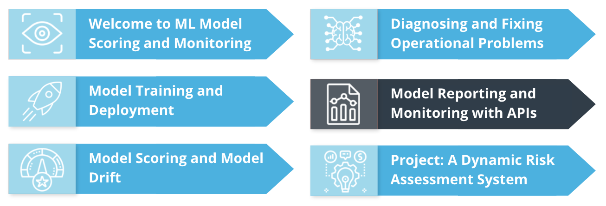
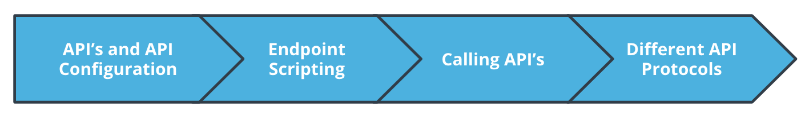
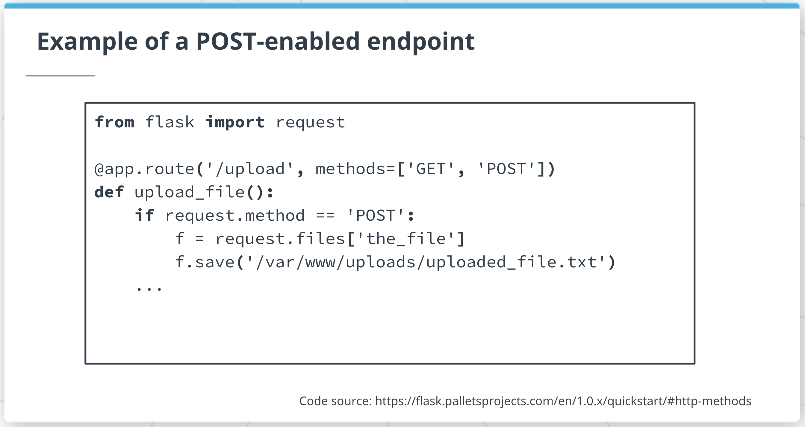
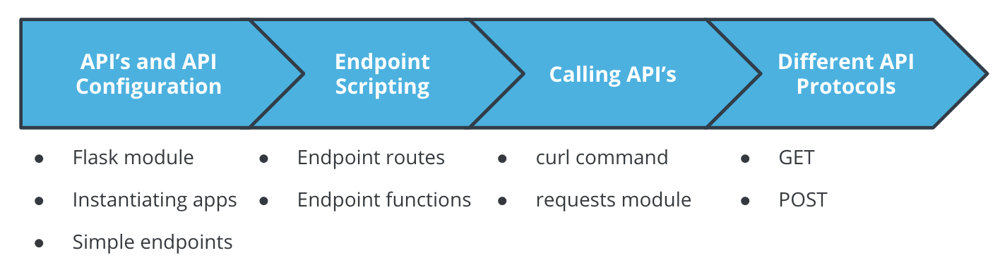

# Model Reporting and Monitoring with API's

**Introduction and Lesson Overview**





**Summary**

ML projects often have many stakeholders and many people who need to know details related to data and model performance, and make sure the project performs as well as possible. Often, it's not feasible for all stakeholders to interact directly with the project to get the information they need. Instead, we need to set up reporting tools to give people easy access to useful information. One of the most versatile ways to set up project reporting is with an API.

In this lesson, we'll discuss model reporting and monitoring with API's. We'll cover all of the following topics:

- API configuration: how to configure simple API's
- Endpoint scripting: how to create endpoint functions that provide meaningful information to API users
- Calling API's: how to call API's from Python scripts and the command line
- Different API protocols: information about other ways to set up advanced API capabilities

Setting up API's for your project is very valuable, because it enables quick, accurate reporting with minimal manual effort, as well as enabling monitoring of potential operational issues.

> Note: We have already used [FastAPI](https://fastapi.tiangolo.com/) previously. In this lesson, we are going to use [Flask](https://flask.palletsprojects.com/en/2.2.x/). As a challenge, you can try 
> to work on the demos and exercises of this lesson using FastAPI too.

## Developing Your Intuition

**Summary**

When you work on ML projects, you become very familiar with them, and you learn how to get any information you need from them at any time.

Your colleagues may not have this same level of familiarity, and they may come to you with requests that you give them some information about the data, the models, or the project. When projects are big and important and get many requests, it will become infeasible for you to provide information and reports to everyone who makes a request.

This is why API's are so useful. API's provide an automated interface between projects and whoever needs to interact with projects. They can provide information to stakeholders, other applications, colleagues, and other reporting tools.

API's can also work in two directions: they can receive as well as give information when appropriate. By setting up API's, you enable a higher volume of quick, accurate reporting about your project. In turn, this ensures that your project is monitored regularly and any operational issues are noticed, diagnosed, and resolved quickly.

## Configuring APIs

**Summary**

In order to configure an API, you need to create a Python script. It's common to call this script `app.py`. These are the things you need to accomplish in your app.py script:

- import needed capabilities from the `flask` module.
- instantiate the app using the `Flask()` command.
- specify an endpoint for users to interact with.
- run the app using the `run()` method, specifying a host and a port.

**Demo**

You can configure an app.py script as follows:

First, import capabilities from the `flask` module:
```
from flask import Flask, request
```
Then, instantiate the app:
```
app = Flask(__name__)
```
Then, specify an endpoint with its own function:
```
@app.route('/')
def index():
    number = request.args.get('number')
    return str(int(number)+1)+'\n'
```
Finally, run the app, specifying both a host and a port:
```
app.run(host='0.0.0.0', port=8000)
```
To run the app, you can run `python3 app.py` from the command line.

**New Terms**

- `flask`: the module we used to create API's in Python
- endpoint: a specification for how API users interact with an API
- host: an IP address that specifies where an API will be hosted
- port: a number that users and API's both need to specify in order to interact

**Additional Resources**

- You can read more about the flask module at the website of its official documentation [here](https://flask.palletsprojects.com/en/1.1.x/).
- There's a page that contains many links to API-related tutorials and resources [here](https://www.fullstackpython.com/flask.html).
- You can read a comparison between flask and one of its alternatives, Django, [here](https://steelkiwi.medium.com/flask-vs-django-how-to-understand-whether-you-need-a-hammer-or-a-toolbox-39b8b3a2e4a5).


## Endpoint Scripting

**Summary**

So far in this lesson, we've worked with very simple **API endpoints**. You should remember the endpoint we created in the solution to the previous exercise:
```
@app.route('/')
def index():
    user = request.args.get('user')
    return "Hello " + user
```
This endpoint contains a route `('/')` and a simple Python function. These are required ingredients in every API endpoint.

API's with one simple endpoint can be useful. But it's often even more useful to have multiple, complex endpoints in an API. There's no limit to the number of endpoints an API can have, or what they can do. This part of the lesson is about how to create API's with multiple, complex endpoints, so they can be as useful as possible for your ML projects.

**Demo: Endpoint Scripting**

**Summary**

Start by reading relevant modules:
```
from flask import Flask, request
import pandas as pd
```
Then, instantiate your app with the Flask() command:
```
app = Flask(__name__)
```
Create a function that will read and return files. We can call this function an auxiliary function, or in other words, a helper function:
```
def readpandas(filename):
    thedata=pd.read_csv(filename)
    return thedata
```
Specify our first endpoint, with a default route:
```
@app.route('/')
def index():
    user = request.args.get('user')
    return str(user=='Bradford') + '\n'   
```
Now, the most important part: specify another endpoint, with a different route, that accomplishes another, more complex task:
```
@app.route('/medians')
def summary():
    filename = request.args.get('filename')  
    thedata=readpandas(filename)
    return str(thedata.median(axis=0))
```
Notice that every endpoint has its own, unique function with its own, unique return statement.

Finally, run the app, specifying a hostname and a port:
```
app.run(host='0.0.0.0', port=8000)
```

**New Terms**

You should be familiar with all of these terms:

- **route:** the name by which a particular endpoint can be accessed by users
- **auxiliary function:** a function that helps the rest of a script accomplish its purpose
- **return statement:** a final line in a Python function that returns a specified value

Additional Resources

- You can read more about API's and endpoint [here](https://www.sqlshack.com/create-rest-apis-in-python-using-flask/).

## Calling API Endpoints

**Summary**

API's are only useful if we call them. There are many kinds of API's, and several different ways to call them. In this lesson, we've created API's with the Flask module. Our Flask API's can be called in one of several different ways:

- from the command line
- from a Python script
- using a hybrid method - calling the command line from a Python script

We'll go over each of these methods for calling your API's.

**Command Line Method**


**Summary**

You need to use the `curl` command to call API's from the terminal's command line. WHen you use curl, you need to specify 3 things to call an API:

- **An IP address** or URL, like `127.0.0.1`. This IP address is called the localhost IP: it always accesses the current machine where your code is running.
- **A port number**, like `8000`. This needs to be the same port that is mentioned in your app.py configuration file.
- **A query string**: this is any string that you want to pass to your API to specify an endpoint and any argument your API endpoint needs

The following is a valid API call from the command line:
```
curl 127.0.0.1:8000?user=brad
```

**Python Script Method**

**Summary**

You can also call your API's from within a Python script. Just like a command line API call, you need to specify three important things:

- an IP address or URL, like `127.0.0.1`. This IP address is called the **localhost** IP: it always accesses the current machine where your code is running.
- a port number, like 8000. This needs to be the same port that is mentioned in your app.py configuration file.
- a query string: this is any string that you want to pass to your API to specify an endpoint and any argument your API endpoint needs

The following is an example of calling an API from a Python script:
```
print(requests.get('http://127.0.0.1:8000?user=brad').content)
```
**Hybrid Method: Terminal Commands From Python Scripts**

**Summary**

Finally, you can use a hybrid method: calling the command line from within a Python script. Just like you needed in the previous methods, you'll need to specify all of these 3 things in your API call:

- **An IP address** or URL, like `127.0.0.1`. This IP address is called the localhost IP: it always accesses the current machine where your code is running.
- **A port number**, like 8000. This needs to be the same port that is mentioned in your app.py configuration file.
- **A query string**: this is any string that you want to pass to your API to specify an endpoint and any argument your API endpoint needs

The following is an example line that calls the command line from within a terminal script:
```
response1=subprocess.run(['curl', '127.0.0.1:8000?user=brad'],capture_output=True).stdout
```
In all cases, you need to make sure that your API is running every time you call it.

**New Terms**

You should be familiar with all of these terms:

- localhost: a special IP address, 127.0.0.1, that refers to the machine where the code is currently running.
- query string: a string that comes after an IP address or URL, and specifies arguments to be passed to an API

Additional Resources

- This [page](https://technologyadvice.com/blog/information-technology/how-to-use-an-api/) contains information about using and calling API's.


## Demo: Calling API Endpoints

**Command Line Method**

You can run the following command to call our API from the command line:
```
curl 127.0.0.1:8000?user=Bradford
```
The previous command accesses the default endpoint, which checks whether a user name is equal to "Bradford".

You can also access the other endpoint as follows:
```
curl 127.0.0.1:8000/medians?filename=demodata.csv
```
In this case, we accessed the "medians" endpoint, which requires us to specify a file name to check column medians for.

**Python Script Method**


You have to import the subprocess module to start:
```
import subprocess
```
Then, you can use subprocess.run() to call the API from the command line and capture the output:
```
response1=subprocess.run(['curl', '127.0.0.1:8000?user=Bradford'],capture_output=True).stdout
print(response1)
```
You can change the argument passed to the run() command to access the medians endpoint:
```
response2=subprocess.run(['curl', '127.0.0.1:8000/medians?filename=demodata.csv'],capture_output=True).stdout
print(response2)
```

**Hybrid Method: Terminal Commands From Python Scripts**

You need to make sure the `requests` module is installed before you try this method, by running this command on the command line:
```
sudo python -m pip install requests
```
Next, open Python2, and import the relevant module:
```
import requests 
```
Use the requests.get() method to call the API's default endpoint:
```
response3=requests.get('http://127.0.0.1:8000?user=Bradford').content 
print(response3) 
```
Change the query string to access the other endpoint:
```
response4=requests.get('http://127.0.0.1:8000/medians?filename=demodata.csv').content 
print(response4)
```

## Above and Beyond: Different API Protocols

All of the API calls we've performed in this lesson have been a specific kind called "**GET requests**". GET requests are the simplest ways to call an API: they provide only a request to "get" some information. They're good for outputting information from the project to users.

However, in many cases, you'll want to input information: allow users to post new data or other files for your project to use. In this case, a GET request usually won't work, and you'll want to use another type of API call, a "**POST request**".

**GET** and **POST** are the two major types of API calls, and they're both referred to as API "methods".

You can see an example of an endpoint that allows POST requests below.




New Terms

- **method:** a standard procedure for calling an API in a particular way
- **GET:** the default type of API call in Flask, used to obtain information from a project
- **POST:** a type of API call used to upload information or files to a project

Additional Resources

- If you want to learn more about different API methods, including GET and POST, we recommend [this page](https://pythonbasics.org/flask-http-methods/).

## Lesson Review

**Summary**

In this lesson, we learned how to perform model reporting and monitoring with API's. We covered the following topics:

- **API configuration:** how to configure simple API's
- **Endpoint scripting:** creating multiple, complex endpoints for API's
- **Calling API's:** how to call API's in several ways
    Different API Methods: different ways that API's can be called to provide or receive information or files

These skills can help you as you're trying to regularly monitor and report about the performance of your ML project.



**Glossary**

Here are terms that were introduced in this lesson:

- **`flask`**: the module we used to create API's in Python
- **endpoint**: a specification for how API users interact with an API
- **host**: an IP address that specifies where an API will be hosted
- **port**: a number that users and API's both need to specify in order to interact
- **route**: the name by which a particular endpoint can be accessed by users
- **auxiliary** function: a function that helps the rest of a script accomplish its purpose
- **return** statement: a final line in a Python function that returns a specified value
- **localhost**: a special IP address, `127.0.0.1`, that refers to the machine where the code is currently running.
- **query** string: a string that comes after an IP address or URL, and specifies arguments to be passed to an API
- **method**: a standard procedure for calling an API in a particular way
- **GET**: the default type of API call in Flask, used to obtain information from a project
- **POST**: a type of API call used to upload information or files to a project

