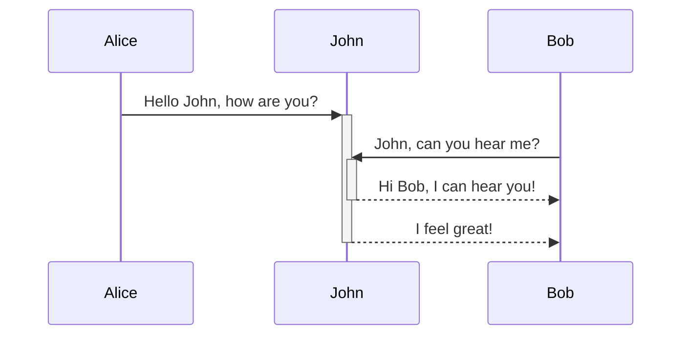

udacity-MLDevOps-engineering-course
===============

Derrick's MLops course (needed private repo.. thanks Steve)

```mermaid
sequenceDiagram
    participant A as Alice
    participant John

    A->>+John: Hello John, how are you?
    Bob->>+John: John, can you hear me?
    John-->>-Bob: Hi Bob, I can hear you!
    John-->>-Bob: I feel great!
```